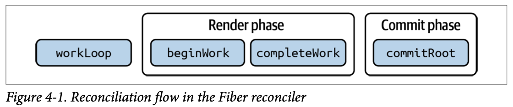
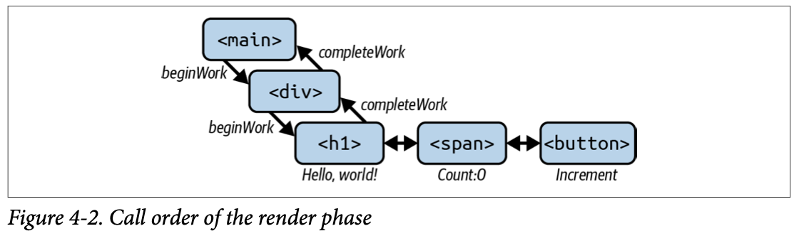
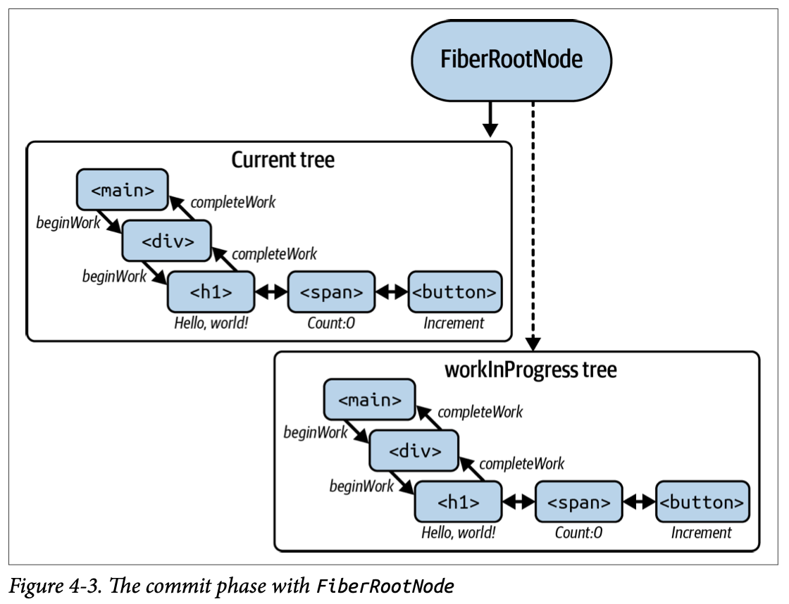

## Inside Reconciliation

### Understanding Reconciliation

As a quick recap, React’s virtual DOM is a blueprint of our desired UI state. React takes this blueprint and, through a process called **reconciliation**, makes it a reality in a given host environment; usually a web browser, but possibly other environments like shells, native platforms like iOS and Android, and more.

### Batching

React batches updates to the real DOM during reconciliation, combining multiple vDOM updates into a single DOM update. This reduces the number of times the real DOM has to be updated and therefore lends itself to better performance for web applications.

```react
function Example() {  
  const [count, setCount] = useState(0); 
  
  const handleClick = () => { 
    setCount((prevCount) => prevCount + 1); 
    setCount((prevCount) => prevCount + 1);  
    setCount((prevCount) => prevCount + 1);  
  };  
  
  return (  
    <div> 
      <p>Count: {count}</p>  
      <button onClick={handleClick}>Increment</button>  
    </div>  
  );
}
```

In this example, the `handleClick` function calls `setCount` three times in quick succession. Without batching, React would update the real DOM three separate times, even though the value of `count` only changed once. This would be wasteful and slow.

However, because React batches updates, it makes one update to the DOM with `count + 3` instead of three updates to the DOM with `count + 1` each time.

To calculate the most efficient batched update to the DOM, React will create a new vDOM tree as a fork of the current vDOM tree with the updated values, where `count` is 3. This tree will need to be reconciled with what is currently in the browser, effectively turning 0 into 3. React will then calculate that just one update is required to the DOM using the new vDOM value 3 instead of manually updating the DOM three times. This is how batching fits into the picture, and it is a part of the broader topic we’re about to dive into: reconciliation, or the process of reconciling the next expected DOM state with the current DOM.

### Prior Art

Previously, React used a stack data structure for rendering.

#### Stack Reconciler (Legacy)

React’s original reconciler was a stack-based algorithm that was used to compare the old and new virtual trees and update the DOM accordingly. While the stack reconciler worked well in simple cases, it presented a number of challenges as applications grew in size and complexity.

Let’s take a quick look at why this was the case. To do so, we’ll consider an example where we’ve got a list of updates to make: 

1. A nonessential computationally expensive component consumes CPU and renders.
2. A user types into an `input` element.
3. `Button` becomes enabled if the input is valid.
4. A containing `Form` component holds the state, so it rerenders.

```react
import React, { useReducer } from "react"; 

const initialState = { text: "", isValid: false }; 

function Form() { 
  const [state, dispatch] = useReducer(reducer, initialState); 
  const handleChange = (e) => {  
    dispatch({ type: "handleInput", payload: e.target.value }); 
  };
  
  return (  
    <div>    
      <ExpensiveComponent />   
      <input value={state.text} onChange={handleChange} />   
      <Button disabled={!state.isValid}>Submit</Button>   
    </div>  
  );
} 

function reducer(state, action) {  
  switch (action.type) {  
    case "handleInput":    
      return {     
        text: action.payload,    
        isValid: action.payload.length > 0,   
      };  
    default:  
      throw new Error(); 
  } 
}
```

In this case, the stack reconciler would render the updates sequentially without being able to pause or defer work. If the computationally expensive component blocks rendering, user input will appear on screen with an observable lag. This leads to poor user experience, since the text field would be unresponsive. Instead, it would be far more pleasant to be able to recognize the user input as a higher-priority update than rendering the nonessential expensive component, and update the screen to reflect the input, deferring rendering the computationally expensive component.

There is a need to be able to bail out of current rendering work if interrupted by higher-priority rendering work, like user input. To do this, React needs to have a sense of priority for certain types of rendering operations over others.

The stack reconciler did not prioritize updates, which meant that less important updates could block more important updates.

In the stack reconciler, updates were executed in the order they were received, which meant that less important updates could block more important updates. For example, if a like counter update was received before a form input update, the like counter update would be executed first and could block the form input update.

Another challenge with the stack reconciler was that it did not allow updates to be interrupted or cancelled.

### The Fiber Reconciler

Similar to how the vDOM is a tree of elements, React uses a Fiber tree in reconcilia‐tion which, as the name suggests, is a tree of Fibers that is directly modeled after the vDOM.

#### Fiber as a Data Structure

The Fiber data structure in React is a key component of the Fiber reconciler. The Fiber reconciler allows updates to be prioritized and executed concurrently, which improves the performance and responsiveness of React applications.

At its core, the Fiber data structure is a representation of a component instance and its state in a React application. As discussed, the Fiber data structure is designed to be a mutable instance and can be updated and rearranged as needed during the reconciliation process.

Each instance of a Fiber node contains information about the component it repre‐sents, including its props, state, and child components. The Fiber node also contains information about its position in the component tree, as well as metadata that is used by the Fiber reconciler to prioritize and execute updates.

Here’s an example of a simple Fiber node:

```js
{   
  tag: 3, // 3 = ClassComponent  
  type: App, 
  key: null, 
  ref: null, 
  props: {   
  	name: "Tejas",  
    age: 30  
  }, 
  stateNode: AppInstance,  
  return: FiberParent, 
  child: FiberChild,  
  sibling: FiberSibling,  
  index: 0,  
  //...
}
```

`tag`

- In this case it’s 3, which React uses to identify class components. Each type of component (class components, function components, Suspense and error bound‐aries, fragments, etc.) has its own numerical ID as Fibers.

`type`

- `App` refers to the function or class component that this Fiber represents.

`props`

- (`{name: "Tejas", age: 30}`) represent the input props to the component, or input arguments to the function.

`stateNode`

- The instance of the App component that this Fiber represents.

  Its position in the component tree: `return`, `child`, `sibling`, and `index` each give the Fiber reconciler a way to “walk the tree,” identifying parents, children, siblings, and the Fiber’s index.

Fiber reconciliation involves comparing the current Fiber tree with the next Fiber tree and figuring out which nodes need to be updated, added, or removed.

This function returns a Fiber derived from elements. Once the Fiber nodes have been created, the Fiber reconciler uses a work loop to update the user interface. The work loop starts at the root Fiber node and works its way down the component tree, marking each Fiber node as “dirty” if it needs to be updated. Once it reaches the end, it walks back up, creating a new DOM tree in memory, detached from the browser, that will eventually be committed (flushed) to the screen. This is represented by two functions: beginWork walks downward, marking components as “need to update,” and completeWork walks back up, constructing a tree of real DOM elements detached from the browser. This off-screen rendering process can be interrupted and thrown away at any time, since the user doesn’t see it.

The Fiber architecture takes inspiration from a concept called “double buffering” in the game world.

#### Double Buffering

Double buffering is a technique used in computer graphics and video processing to reduce flicker and improve perceived performance. The technique involves creating two buffers (or memory spaces) for storing images or frames, and switching between them at regular intervals to display the final image or video.

Here’s how double buffering works in practice: 

1. The first buffer is filled with the initial image or frame.
2. While the first buffer is being displayed, the second buffer is updated with new data or images.
3. When the second buffer is ready, it is switched with the first buffer and displayed on the screen.
4. The process continues, with the first and second buffers being switched at regular intervals to display the final image or video.

By using double buffering, flicker and other visual artifacts can be reduced, since the final image or video is displayed without interruptions or delays.

Fiber reconciliation is similar to double buffering such that when updates happen, the current Fiber tree is forked and updated to reflect the new state of a given user interface. This is called rendering. Then, when the alternate tree is ready and accurately reflects the state a user expects to see, it is swapped with the current tree similarly to how video buffers are swapped in double buffering. This is called the commit phase of reconciliation or a commit.

By using a work-in-progress tree, the Fiber reconciler presents a number of benefits: 

- It can avoid making unnecessary updates to the real DOM, which can improve performance and reduce flicker.
- It can compute the new state of a UI off-screen, and throw it away if a newer higher-priority update needs to happen.
- Since reconciliation happens off-screen, it can even pause and resume without messing up what the user currently sees.

With the Fiber reconciler, two trees are derived from a user-defined tree of JSX elements: one tree containing “current” Fibers, and another tree containing work-inprogress Fibers. Let’s explore these trees a little more.

#### Fiber Reconciliation

Fiber reconciliation happens in two phases: the render phase and the commit phase. This two-phase approach, shown in Figure 4-1, allows React to do rendering work that can be disposed of at any time before committing it to the DOM and showing a new state to users: it makes rendering interruptible. To be a little bit more detailed, what makes rendering feel interruptible are the heuristics employed by the React scheduler of yielding the execution back to the main thread every 5 ms, which is smaller than a single frame even on 120 fps devices.



##### The render phase

The render phase starts when a state-change event occurs in the current tree. React does the work of making the changes off-screen in the `alternate` tree by recursively stepping through each Fiber and setting flags that signal updates are pending (see Figure 4-2). As we alluded to earlier, this happens in a function called `beginWork` internally in React.



**beginWork.** `beginWork` is responsible for setting flags on Fiber nodes in the work-inprogress tree about whether or not they should update. It sets a bunch of flags and then recursively goes to the next Fiber node, doing the same thing until it reaches the bottom of the tree. When it finishes, we start calling `completeWork` on the Fiber nodes and walk back up.

The signature of `beginWork` is as follows:

```typescript
function beginWork( 
	current: Fiber | null, 
  workInProgress: Fiber,  
  renderLanes: Lanes 
): Fiber | null;
```

`current`

- A reference to the Fiber node in the current tree that corresponds to the work-in-progress node being updated. This is used to determine what has changed between the previous version and the new version of the tree, and what needs to be updated. This is never mutated and is only used for comparison.

`workInProgress`

- The Fiber node being updated in the work-in-progress tree. This is the node that will be marked as “dirty” if updated and returned by the function.

`renderLanes`

- Render lanes is a new concept in React’s Fiber reconciler that replaces the older `renderExpirationTime`. It’s a bit more complex than the old `renderExpirationTime` concept, but it allows React to better prioritize updates and make the update process more efficient.

  It is essentially a bitmask that represents “lanes” in which an update is being pro‐cessed. Lanes are a way of categorizing updates based on their priority and other factors. When a change is made to a React component, it is assigned a lane based on its priority and other characteristics. The higher the priority of the change, the higher the lane it is assigned to.

  The `renderLanes` value is passed to the `beginWork` function in order to ensure that updates are processed in the correct order. Updates that are assigned to higher-priority lanes are processed before updates that are assigned to lowerpriority lanes. This ensures that high-priority updates, such as updates that affect user interaction or accessibility, are processed as quickly as possible.

  In addition to prioritizing updates, `renderLanes` also helps React better manage concurrency. React uses a technique called “time slicing” to break up longrunning updates into smaller, more manageable chunks. `renderLanes` plays a key role in this process, as it allows React to determine which updates should be processed first, and which updates can be deferred until later.

  After the render phase is complete, the `getLanesToRetrySynchronouslyOnError` function is called to determine if any deferred updates were created during the render phase. If there are deferred updates, the `updateComponent` function starts a new work loop to handle them, using `beginWork` and `getNextLanes` to process the updates and prioritize them based on their lanes.

**completeWork.** The `completeWork` function applies updates to the work-in-progress Fiber node and constructs a new real DOM tree that represents the updated state of the application. It constructs this tree detached from the DOM out of the plane of browser visibility.

If the host environment is a browser, this means doing things like `document.createElement` or `newElement.appendChild`. Keep in mind, this tree of elements is not yet attached to the in-browser document: React is just creating the next version of the UI off-screen. Doing this work off-screen makes it interruptible: whatever next state React is computing is not yet painted to the screen, so it can be thrown away in case some higher-priority update gets scheduled. This is the whole point of the Fiber reconciler.

The signature of `completeWork` is as follows:

```typescript
function completeWork(  
	current: Fiber | null,  
	workInProgress: Fiber,  
	renderLanes: Lanes 
): Fiber | null;
```

The `completeWork` function is closely related to the `beginWork` function. While begin Work is responsible for setting flags about “should update” state on a Fiber node, `completeWork` is responsible for constructing a new tree to be committed to the host environment. When `completeWork` reaches the top and has constructed the new DOM tree, we say that “the render phase is completed.” Now, React moves on to the commit phase.

##### The commit phase

The commit phase (see Figure 4-3) is responsible for updating the actual DOM with the changes that were made to the virtual DOM during the render phase. During the commit phase, the new virtual DOM tree is committed to the host environment, and the work-in-progress tree is replaced with the current tree. It’s in this phase that all effects are also run. The commit phase is divided into two parts: the **mutation phase** and the **layout phase**.



**The mutation phase.** The mutation phase is the first part of the commit phase, and it is responsible for updating the actual DOM with the changes that were made to the vir‐tual DOM. During this phase, React identifies updates that need to be made and calls a special function called `commitMutationEffects`. This function applies the updates that were made to Fiber nodes in the alternate tree during the render phase to the actual DOM.

Here’s an full-pseudocode example of how `commitMutationEffects` might be implemented:

```js
function commitMutationEffects(Fiber) { 
  switch (Fiber.tag) {   
    case HostComponent: { 
      // Update DOM node with new props and/or children  
      break;    
    }   
    case HostText: {    
      // Update text content of DOM node   
      break;   
    }  
    case ClassComponent: {    
      // Call lifecycle methods like componentDidMount and componentDidUpdate 
      break;   
    }   
      // ... other cases for different types of nodes  
  }
}
```

During the mutation phase, React also calls other special functions, such as `commitUnmount` and `commitDeletion`, to remove nodes from the DOM that are no longer needed.

**The layout phase.** The layout phase is the second part of the commit phase, and it is responsible for calculating the new layout of the updated nodes in the DOM. During this phase, React calls a special function called `commitLayoutEffects`. This function calculates the new layout of the updated nodes in the DOM.

Like `commitMutationEffects`, `commitLayoutEffects` is also a massive switch state‐ment that calls different functions, depending on the type of node being updated.

Once the layout phase is complete, React has successfully updated the actual DOM to reflect the changes that were made to the virtual DOM during the render phase.

By dividing the commit phase into two parts (mutation and layout), React is able to apply updates to the DOM in an efficient manner. By working in concert with other key functions in the reconciler, the commit phase helps to ensure that React applica‐tions are fast, responsive, and reliable, even as they become more complex and handle larger amounts of data.

**Effects.** During the commit phase of React’s reconciliation process, side effects are performed in a specific order, depending on the type of effect. There are several types of effects that can occur during the commit phase, including:

**Placement effects**

- These effects occur when a new component is added to the DOM. For example, if a new button is added to a form, a placement effect will occur to add the button to the DOM.

**Update effects**

- These effects occur when a component is updated with new props or state. For example, if the text of a button changes, an update effect will occur to update the text in the DOM.

**Deletion effects**

- These effects occur when a component is removed from the DOM. For example, if a button is removed from a form, a deletion effect will occur to remove the but‐ton from the DOM.

**Layout effects**

- These effects occur before the browser has a chance to paint, and are used to update the layout of the page. Layout effects are managed using the `useLayoutEffect` hook in function components and the `componentDidUpdate` lifecycle method in class components.

In contrast to these commit-phase effects, passive effects are user-defined effects that are scheduled to run after the browser has had a chance to paint. Passive effects are managed using the `useEffect` hook.

Passive effects are useful for performing actions that are not critical to the initial ren‐dering of the page, such as fetching data from an API or performing analytics track‐ing. Because passive effects are not performed during the render phase, they do not affect the time required to compute a minimal set of updates required to bring a user interface into the developer’s desired state.

##### Putting everything on the screen

React maintains a `FiberRootNode` atop both trees that points to one of the two trees: the current or the `workInProgress` tree. The `FiberRootNode` is a key data structure that is responsible for managing the commit phase of the reconciliation process.

When updates are made to the virtual DOM, React updates the `workInProgress` tree, while leaving the current tree unchanged. This allows React to continue rendering and updating the virtual DOM, while also preserving the current state of the application.

When the rendering process is complete, React calls a function called `commitRoot`, which is responsible for committing the changes made to the `workInProgress` tree to the actual DOM. `commitRoot` switches the pointer of the `FiberRootNode` from the current tree to the `workInProgress` tree, making the `workInProgress` tree the new current tree.

From this point on, any future updates are based on the new current tree. This pro‐cess ensures that the application remains in a consistent state, and that updates are applied correctly and efficiently.

All of this appears to happen instantly in the browser. This is the work of reconciliation.