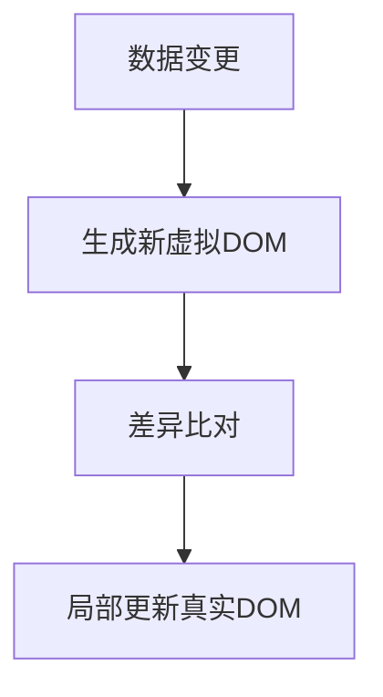
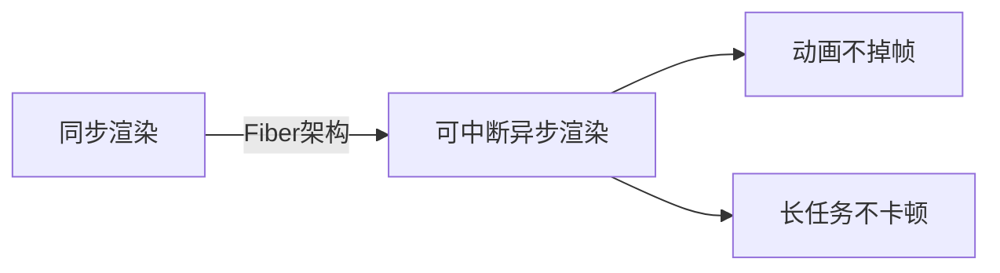
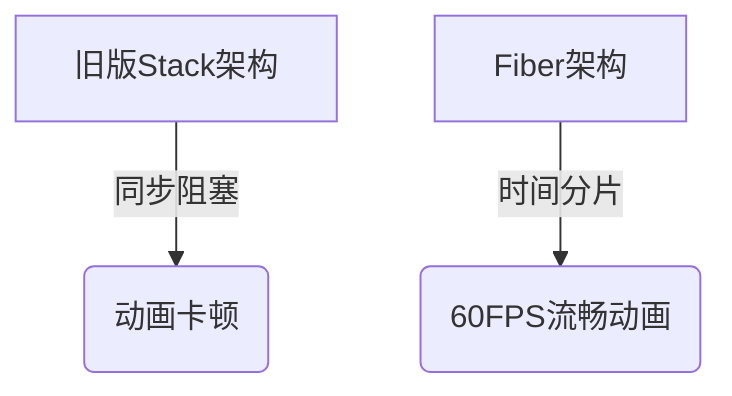
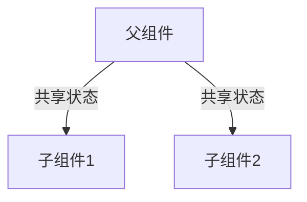
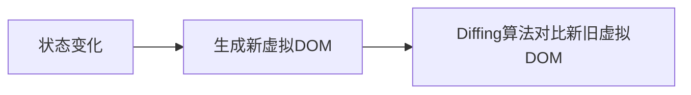
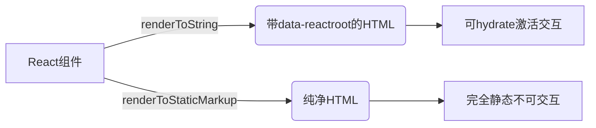

### 1. **什么是 React？**

React（又称 React.js 或 ReactJS）是一个**开源的前端 JavaScript 库**，用于基于组件化开发可组合的用户界面，尤其适合构建单页应用（SPA）。它采用声明式编程范式，专注于高效管理 Web 和移动应用的视图层。

#### **核心特性**

1. **组件化架构**：将 UI 拆分为独立可复用的组件
2. **声明式设计**：通过描述“UI 应该是什么状态”来简化开发
3. **虚拟 DOM**：优化渲染性能，减少直接操作真实 DOM
4. **单向数据流**：数据从父组件向子组件单向传递，提升可预测性

#### **历史背景**

* **创始人**：Facebook 工程师 [Jordan Walke](https://github.com/jordwalke)
* **首次应用**：
  * 2011 年用于 Facebook 动态消息（News Feed）
  * 2012 年扩展至 Instagram

---

### 2. **React 的发展历史**  

React 的演进历程始于 2010 年，其核心思想可追溯至 Facebook 内部项目 **XHP**。以下是关键里程碑：  

#### **1. XHP：React 的灵感起源（2010）**  
- **技术本质**：PHP 的扩展，允许 XML 片段作为合法 PHP 表达式  
- **核心目标**：  
  - 创建可复用的 HTML 组件  
  - 增强代码可读性  
  - 自动过滤恶意内容（防御 XSS 攻击）  
- **局限性**：  
  - 动态网页仍需频繁与服务器交互  
  - 任何微小改动都会触发全页面重新渲染  

#### **2. FaxJS：React 的原型（2011）**  
- **开发者**：Facebook 工程师 Jordan Walke  
- **创新点**：  
  - 将 XHP 的思想移植到 JavaScript  
  - 首次尝试虚拟 DOM 概念（减少直接操作真实 DOM）  

#### **3. React 正式诞生（2013）**  
- **开源发布**：2013 年 5 月首次开源  
- **早期应用**：  
  - 2011 年用于 Facebook News Feed  
  - 2012 年部署至 Instagram  
- **标志性创新**：  
  - **JSX**：继承 XHP 的“混合标记与逻辑”理念  
  - **组件化**：颠覆传统 MVC 的 UI 开发模式  

#### **4. 后续演进**  
- **2015**：引入函数组件、React Native 发布  
- **2016**：Redux 成为状态管理标准  
- **2018**：推出 React Hooks（函数式组件革命）  
- **2022**：React 18 发布，支持并发渲染  

#### **技术传承关系**  
```
XHP（PHP） → FaxJS（原型） → React（JS+虚拟DOM） → 现代前端生态
```

> 🌟 **历史启示**：  
> React 的成功源于解决 XHP 的遗留问题——通过**虚拟 DOM** 实现高效局部更新，同时保留 XHP 的**组件化**与**声明式**优势。  

这段历史解释了为何 React 会采用 JSX 等看似“混合技术栈”的设计，实则是为解决动态网页的渲染效率问题而生的渐进式创新。

---

### 3. **React 的核心特性**  

1. **JSX 语法**  
   - 允许在 JavaScript 中直接编写 HTML 结构  
   - 示例：  
     ```jsx
     const element = <h1>Hello, JSX!</h1>;
     ```

2. **虚拟 DOM（Virtual DOM）**  
   - 通过内存中的轻量级 DOM 副本优化渲染性能  
   - 仅更新实际发生变化的部分，减少真实 DOM 操作  

3. **服务端渲染（SSR）**  
   - 支持在服务器端生成 HTML，提升首屏加载速度和 SEO  

4. **单向数据流**  
   - 数据从父组件向子组件单向传递，保证可预测性  
   - 典型应用：React + Redux 架构  

5. **组件化开发**  
   - 将 UI 拆分为独立可复用的组件  
   - 示例：  
     ```jsx
     function Button({ text }) {
       return <button>{text}</button>;
     }
     ```

> 🌟 **设计哲学**：  
> “高效渲染 + 声明式组件 = 构建可维护的现代化应用”  

这些特性共同使 React 成为构建动态、高性能用户界面的首选方案。

---

### 4. **什么是 JSX？**  

**JSX**（JavaScript XML）是 JavaScript 的语法扩展，允许在 JavaScript 代码中直接编写类似 HTML 的结构。它本质上是 `React.createElement()` 的语法糖，结合了 JavaScript 的表达能力和 HTML 的直观性。  

#### **核心特性**  
1. **类 HTML 语法**：直接在 JS 中书写标记语言  
2. **JavaScript 表达式嵌入**：使用 `{}` 包裹动态内容  
3. **编译转换**：最终会被转译为 `React.createElement()` 调用  

#### **代码对比**  
```jsx
// 使用 JSX（推荐）
function App() {
  return <h1 className="greeting">Hello, JSX!</h1>;
}

// 等效的纯 JavaScript 写法
function App() {
  return React.createElement(
    "h1",
    { className: "greeting" },
    "Hello, JSX!"
  );
}
```

#### **类组件中的 JSX**  
```jsx
class App extends React.Component {
  render() {
    return <h1 className="greeting">Hello, Class Component!</h1>;
  }
}
```

#### **注意事项**  
⚠️ **比 HTML 更严格**  
- 必须闭合标签（如 ``）  
- 属性名用驼峰式（如 `className` 替代 `class`）  
- 表达式需用 `{}` 包裹  

> 🌟 **设计初衷**：  
> 通过声明式语法提升 UI 代码的可读性和开发效率，同时保持 JavaScript 的完整编程能力。  

JSX 是 React "视觉与逻辑耦合"理念的核心体现，虽需编译但大幅降低了开发复杂度。

---

### 5. **React 元素（Element）与组件（Component）的区别**

#### **1. 元素（Element）**
- **本质**：普通对象，描述屏幕上应渲染的内容（DOM 节点或其他组件）
- **特点**：
  - 不可变（创建后无法修改）
  - 创建成本低
  - 是构成 UI 的最小单位
- **JS 对象结构**：
  ```javascript
  {
    type: 'div',         // DOM 节点类型或组件
    props: {             // 属性和子元素
      children: 'Login', 
      id: 'login-btn'
    }
  }
  ```
- **创建方式**：
  ```javascript
  // 原生 JavaScript
  const element = React.createElement("div", { id: "login-btn" }, "Login");
  
  // JSX 语法糖
  const element = <div id="login-btn">Login</div>;
  ```

#### **2. 组件（Component）**
- **本质**：接收 props 并返回 JSX 的函数或类
- **特点**：
  - 可复用 UI 逻辑单元
  - 可以包含状态和生命周期
  - 最终产出 React 元素树
- **声明方式**：
  ```javascript
  // 函数组件
  const Button = ({ handleLogin }) => (
    <div id="login-btn" onClick={handleLogin}>
      Login
    </div>
  );
  
  // 类组件
  class Button extends React.Component {
    render() {
      return <div id="login-btn" onClick={this.props.handleLogin}>Login</div>;
    }
  }
  ```
- **编译结果**：
  ```javascript
  // 最终都会被转译为 React.createElement()
  const Button = ({ handleLogin }) => 
    React.createElement("div", { id: "login-btn", onClick: handleLogin }, "Login");
  ```

#### **核心区别**
| 维度         | 元素（Element）                | 组件（Component）               |
| ------------ | ------------------------------ | ------------------------------- |
| **本质**     | 描述 UI 的不可变对象           | 生成元素的函数/类               |
| **复杂度**   | 静态的简单对象                 | 可包含逻辑、状态和生命周期      |
| **创建方式** | `React.createElement()` 或 JSX | 函数或类定义                    |
| **关系**     | 组件通过 `render()` 返回元素   | 元素可以包含其他组件作为 `type` |

> 🌟 **形象比喻**：  
> 元素像是建筑图纸上的一个螺丝钉标注，组件则是能批量生产螺丝钉的模具。

---

### 6. **React 组件的创建方式**

在 React 中，组件是构建用户界面(UI)的基本单元。共有两种创建组件的方法：

#### **1. 函数组件（推荐）**
- **特点**：  
  - 纯 JavaScript 函数  
  - 接收 `props` 作为唯一参数  
  - 直接返回 JSX 元素  
- **示例**：
  ```jsx
  function Welcome({ name }) {
    return <h1>你好，{name}！</h1>;
  }
  ```

#### **2. 类组件（传统写法）**
- **特点**：  
  - 使用 ES6 class 定义  
  - 必须包含 `render()` 方法  
  - 通过 `this.props` 访问参数  
- **示例**：
  ```jsx
  class Welcome extends React.Component {
    render() {
      return <h1>你好，{this.props.name}！</h1>;
    }
  }
  ```

#### **现代开发建议**
✅ **优先使用函数组件**：配合 Hooks 可实现所有类组件功能，代码更简洁  
⏳ **类组件适用场景**：维护历史项目时可能遇到  

> 🌟 **关键区别**：  
> - 函数组件：无状态（可通过 Hooks 添加）  
> - 类组件：自带状态管理和生命周期  

两种组件最终都会被编译为 React 元素，但函数组件已成为现代 React 开发的主流选择。

---

### 7. **何时选择类组件而非函数组件？**  

自 React 16.8 引入 Hooks 后，**函数组件已成为官方推荐写法**，因其可通过 Hooks 实现类组件的所有功能（状态、生命周期等）。但在以下两种场景仍需使用类组件：  

#### **1. 必须使用类组件的场景**  
- **错误边界（Error Boundaries）**  
  - 目前仅类组件能实现 `componentDidCatch` 生命周期  
  - *替代方案*：使用第三方库如 [`react-error-boundary`](https://github.com/bvaughn/react-error-boundary)（无需类组件）  
  ```jsx
  "use client";
  import { ErrorBoundary } from "react-error-boundary";
  
  <ErrorBoundary fallback={<div>出错啦！</div>}>
    <ExampleApplication />
  </ErrorBoundary>
  ```

#### **2. 历史遗留场景**  
- 维护旧版代码时，若组件需使用 `state` 或生命周期方法（如 `componentDidMount`）  

#### **选择标准总结**  
| **组件类型** | **适用场景**                                                 |
| ------------ | ------------------------------------------------------------ |
| **函数组件** | ✅ 无状态展示组件<br/>✅ 配合 Hooks 实现状态/副作用<br/>✅ 追求代码简洁性和可读性 |
| **类组件**   | ⚠️ 错误边界（除非用第三方库）<br/>⚠️ 维护旧代码库              |

#### **现代开发建议**  
- **优先使用函数组件 + Hooks**：`useState`、`useEffect` 等已覆盖绝大多数场景  
- **错误边界**：直接使用 `react-error-boundary` 等现成方案，避免手动编写类组件  

> 📌 **核心原则**：  
> “新项目全面拥抱函数组件，旧项目逐步迁移；特殊场景（如错误边界）评估第三方方案。”  

随着 React 生态发展，类组件的必要性已大幅降低，官方文档也以函数组件为主要教学范例。

---

### 8. 什么是纯组件？

纯组件是指对于相同的状态和属性（props）会渲染出相同输出的组件。在函数组件中，可以通过使用 `React.memo()` API 包裹组件来实现纯组件。该 API 通过浅层比较（shallow comparison）来对比新旧属性，从而避免不必要的重新渲染，因此有助于性能优化。

但需要注意的是，`React.memo()` 不会比较前后状态（state）的变化，因为函数组件在设置相同状态时，默认就会阻止不必要的渲染。

记忆化（memoized）组件的语法如下：

```jsx
const MemoizedComponent = memo(SomeComponent, arePropsEqual?);
```

以下示例展示了子组件（即 `EmployeeProfile`）如何在父组件（即 `EmployeeRegForm`）传递相同属性时避免重新渲染：

```jsx
import { memo, useState } from "react";

const EmployeeProfile = memo(function EmployeeProfile({ name, email }) {
  return (
    <>
      <p>姓名：{name}</p>
      <p>邮箱：{email}</p>
    </>
  );
});
export default function EmployeeRegForm() {
  const [name, setName] = useState("");
  const [email, setEmail] = useState("");
  return (
    <>
      <label>
        姓名：<input value={name} onChange={(e) => setName(e.target.value)} />
      </label>
      <label>
        邮箱：<input value={email} onChange={(e) => setEmail(e.target.value)} />
      </label>
      <hr />
      <EmployeeProfile name={name} />
    </>
  );
}
```

在上述代码中，子组件并未接收 `email` 属性，因此当 `email` 变化时不会触发重新渲染。

在类组件中，继承自 `React.PureComponent`（而非 `React.Component`）的组件会成为纯组件。当属性或状态变化时，`PureComponent` 会通过调用 `shouldComponentUpdate()` 生命周期方法对属性和状态进行浅层比较。

**注意：** `React.memo()` 是一个高阶组件。

---

### 9. 什么是 React 中的状态（state）？

组件的 **状态** 是一个存储信息的对象，这些信息可能会在组件的生命周期内发生变化。关键在于，每当状态对象发生变化时，组件就会重新渲染。通常建议尽量简化状态，并减少有状态组件的数量。


以带有 `message` 状态的 **User** 组件为例。这里使用了 **useState** Hook 来为 User 组件添加状态，该 Hook 返回一个数组，包含当前状态和更新状态的函数。

```jsx
import { useState } from "react";

function User() {
  const [message, setMessage] = useState("欢迎来到 React 世界");

  return (
    <div>
      <h1>{message}</h1>
    </div>
  );
}
```

每当 React 调用你的组件或访问 `useState` Hook 时，它都会提供该次渲染的状态快照。

状态（state）与属性（props）类似，但它是私有的，完全由组件自身控制，即其他组件无法访问，除非拥有该状态的组件主动传递它。

---

### 10. 什么是 React 中的 props？

**Props** 是组件的输入参数。它们可以是单个值或包含一组值的对象，在创建组件时传递（类似于 HTML 标签属性）。这些数据总是从父组件向下传递到子组件。

React 中 props 的主要功能包括：
1. 向组件传递自定义数据
2. 触发状态变更
3. 在组件的 `render()` 方法中通过 `this.props.reactProp` 访问

例如，我们创建一个带有 `reactProp` 属性的元素：
```jsx
<Element reactProp={"1"} />
```
这个 `reactProp`（或任意自定义的）属性名会成为 React 原生 props 对象的属性，所有通过 React 创建的组件都自带这个 props 对象：
```jsx
props.reactProp;
```

函数组件中使用 props 的示例如下：
```jsx
import React from "react";
import ReactDOM from "react-dom";

const ChildComponent = (props) => {
  return (
    <div>
      <p>{props.name}</p>
      <p>{props.age}</p>
      <p>{props.gender}</p>
    </div>
  );
};

const ParentComponent = () => {
  return (
    <div>
      <ChildComponent name='John' age='30' gender='male' />
      <ChildComponent name='Mary' age='25' gender='female' />
    </div>
  );
};
```

通过 ES6（ECMAScript 2015）的解构特性可以直接访问 props 对象的属性。当未指定 prop 值时还可以设置默认值，上述子组件可以简化为：
```jsx
const ChildComponent = ({ name, age, gender = "male" }) => {
  return (
    <div>
      <p>{name}</p>
      <p>{age}</p>
      <p>{gender}</p>
    </div>
  );
};
```

**注意：** 如果传递 `null` 或 `0` 值，则不会使用默认值。默认值仅在 prop 值缺失或传递 `undefined` 时生效。

---

### 11. React 中 state 和 props 有什么区别？

在 React 中，`state` 和 `props` 虽然都是普通的 JavaScript 对象，都用于管理组件数据，但它们的用途和特性有本质区别：

**state（状态）**  
- 由组件自身管理，可通过 setter 函数（类组件用 `setState()`）更新
- 作为组件的"内部记忆"，可被组件自身修改
- 状态变化会触发组件及其子组件的重新渲染
- 仅使用 state 的组件难以实现复用

**props（属性）**  
- 由父组件传入，具有`只读性`（接收组件不能直接修改）
- 类似于函数的参数，用于配置组件行为
- 是组件间数据传递的主要方式
- 使用 props 能使组件高度可复用

**核心比喻**  
- state 是组件的"私有记忆"（可修改）
- props 是组件的"配置参数"（不可修改）

这种设计使得 React 组件既能维护自身状态，又能通过 props 实现灵活的组合与复用。

---

### 12. HTML 与 React 事件处理的区别

以下是两者事件处理的主要差异：

1. **事件命名规范不同**  
   - HTML 采用**全小写**：  
     ```html
     <button onclick="activateLasers()"></button>
     ```
   - React 采用**驼峰式**：   
     ```jsx
     <button onClick={activateLasers}>
     ```

2. **阻止默认行为的方式不同**  
   - HTML 通过返回 `false`：  
     ```html
     <a href="#" onclick='console.log("链接被点击"); return false;' />
     ```
   - React 必须显式调用 `preventDefault()`：  
     ```javascript
     function handleClick(event) {
       event.preventDefault();
       console.log("链接被点击");
     }
     ```

3. **函数调用方式不同**  
   - HTML 需要带括号 `()` 调用函数  
   - React 直接传递函数名（无需括号），如第一个示例中的 `activateLasers`

**关键区别总结**  
React 的事件处理是声明式的，而 HTML 是字符串形式的命令式写法。React 使用合成事件（SyntheticEvent）实现跨浏览器兼容，这种设计使事件处理更符合现代 JavaScript 的编程模式。

---

### 13. 什么是 React 中的合成事件（SyntheticEvent）？

`SyntheticEvent` 是 React 封装的跨浏览器原生事件包装器。其 API 与浏览器原生事件一致（包括 `stopPropagation()` 和 `preventDefault()` 等方法），但能确保所有浏览器表现一致。通过 `nativeEvent` 属性可直接访问底层原生事件。

以书店标题搜索组件为例，演示如何获取所有原生事件属性：

```jsx
function BookStore() {
  function handleTitleChange(e) {
    console.log("新标题:", e.target.value);
    // 'e' 是合成事件对象
    const nativeEvent = e.nativeEvent; // 获取原生事件
    console.log(nativeEvent); // 打印原生事件对象
    e.stopPropagation();  // 阻止事件冒泡
    e.preventDefault();   // 阻止默认行为
  }

  return <input name='title' onChange={handleTitleChange} />;
}
```

**核心特性**：
1. **跨浏览器一致性**：消除浏览器间事件差异
2. **事件池机制**：提升性能（事件对象会被复用）
3. **原生事件访问**：通过 `e.nativeEvent` 获取
4. **相同API**：与DOM事件方法完全兼容

这种设计既保持了开发体验的一致性，又优化了React的性能表现。

---

### 14. 什么是行内条件表达式？

在 React 中，除了常规的 if 语句和三元表达式外，还可以直接在 JSX 中通过以下方式实现条件渲染：

1. **逻辑与运算符（&&）**  
   适用于简单条件判断，当条件为真时渲染右侧内容：
   ```jsx
   {isLoggedIn && <AdminPanel />}
   ```

2. **三元表达式（?:）**  
   适合二选一的条件渲染场景（示例改写原代码）：
   ```jsx
   <h1>你好！</h1>
   {
     messages.length > 0 && !isLogin 
       ? <h2>您有 {messages.length} 条未读消息</h2>
       : <h2>您没有未读消息</h2>
   }
   ```

**关键特点**：

- 所有条件表达式需用 `{}` 包裹
- 逻辑与运算符会跳过 `false`/`null`/`undefined` 等 falsy 值
- 三元表达式必须包含 `:` 后的备选方案

这种写法让条件渲染能够更简洁地内联在 JSX 结构中，适合简单的条件逻辑。复杂条件仍建议提取为独立函数或变量保持代码可读性。

---

### 15. 什么是 `key` 属性？在数组元素中使用它有什么好处？

`key` 是一个特殊属性，在渲染数组数据时**必须**包含。它帮助 React 识别哪些元素被修改、添加或删除。

#### 核心作用
- **高效更新**：通过 key 精准追踪元素变化，减少不必要的 DOM 操作
- **状态保持**：确保组件状态在重新渲染时正确保留

#### 使用规范
1. **优先使用数据 ID**（最佳实践）：
   ```jsx
   const todoItems = todos.map((todo) => 
     <li key={todo.id}>{todo.text}</li>
   );
   ```

2. **万不得已才用索引**（需满足以下条件）：
   ```jsx
   const todoItems = todos.map((todo, index) =>
     <li key={index}>{todo.text}</li>
   );
   ```

#### 重要注意事项
1. **避免索引作为 key**：当列表顺序可能变化时，会导致性能问题和状态错乱
2. **组件提取场景**：若将列表项抽离为独立组件，key 应加在组件上而非 `<li>` 标签
3. **控制台警告**：未提供 key 时 React 会显示警告
4. **类型要求**：接受字符串或数字（内部会转为字符串）
5. **禁止动态生成**：如 `key={Math.random()}` 会导致每次渲染都重建 DOM

#### 为什么需要 key？
当列表变化时，React 会通过 key 进行高效的「差异比对」（diffing），确保：
- 元素移动时复用 DOM 节点
- 状态与正确元素保持关联
- 提升渲染性能

> 示例：假设删除列表中间项，没有 key 会导致后续元素全部重新渲染，而有 key 时 React 能精准定位变化项

---

### 16. 什么是虚拟 DOM（Virtual DOM）？

虚拟 DOM 是真实 DOM 的内存化表示，其核心工作原理可分为三个关键点：

1. **内存镜像**  
   在 JavaScript 内存中构建的轻量级 UI 树形结构，完整映射真实 DOM 的节点关系

2. **差异同步机制**  
   - 当状态变更时，先在虚拟 DOM 中进行计算
   - 通过高效的 diff 算法比对变更前后的虚拟 DOM 树
   - 最终仅将必要的更新批量同步到真实 DOM

3. **协调过程（Reconciliation）**  
   从调用渲染函数到屏幕显示之间的完整处理流程：  
   
   ```mermaid
   graph LR
   A[State Change] --> B[New VDOM Tree]
   B --> C[Diff Algorithm]
   C --> D[Minimal DOM Updates]
   ```

**核心价值**：  
- 避免直接操作真实 DOM 的性能损耗
- 通过批量更新减少重绘/回流次数
- 实现跨平台渲染（如 React Native）的基础层

> 示例：当列表数据更新时，虚拟 DOM 会先比较新旧节点树，仅重绘发生变化的 `<li>` 元素，而非整个列表

---

### 17. 虚拟 DOM 的工作原理

虚拟 DOM 通过以下三个核心步骤实现高效更新：

1. **全量虚拟渲染**  
   当数据变化时，首先在内存中重新生成完整的虚拟 DOM 树  
     
   
2. **差异计算（Diffing）**  
   通过算法比对新旧虚拟 DOM 树的差异节点  
     
   
3. **精准 DOM 更新**  
   仅将计算出的差异部分批量更新到真实 DOM  
     

**流程本质**：  


这种机制通过「内存计算 + 最小化 DOM 操作」的组合策略，相比直接操作 DOM 具有显著的性能优势，尤其在频繁更新的复杂交互场景中表现更为突出。

---

### 18. Shadow DOM 和 Virtual DOM 的区别

#### 本质差异
| 维度         | Shadow DOM                            | Virtual DOM                  |
| ------------ | ------------------------------------- | ---------------------------- |
| **技术性质** | 浏览器原生支持的封装技术              | JavaScript 库实现的抽象层    |
| **主要用途** | 解决 Web Components 的样式/作用域隔离 | 优化 DOM 更新性能            |
| **实现层级** | 浏览器引擎层面实现                    | 应用层通过 JavaScript 库实现 |

#### 技术特点
**Shadow DOM**  
- 浏览器原生 API（无需第三方库）
- 创建独立的 DOM 子树（Shadow Tree）
- 天然支持 CSS 样式隔离
- 适用于构建封装型 Web Components

**Virtual DOM**  
- React 等框架的核心机制
- 内存中的轻量级 DOM 表示
- 通过 Diff 算法实现高效更新
- 主要解决频繁 DOM 操作的性能问题

#### 典型应用场景
```javascript
// Shadow DOM 示例（原生组件封装）
class MyComponent extends HTMLElement {
  constructor() {
    super();
    const shadow = this.attachShadow({ mode: 'open' });
    shadow.innerHTML = `
      <style>button { color: red }</style>
      <button>Shadow DOM 按钮</button>
    `;
  }
}

// Virtual DOM 示例（React 组件）
function MyComponent() {
  return (
    <div>
      <button style={{ color: 'red' }}>Virtual DOM 按钮</button>
    </div>
  );
}
```

#### 协作关系
现代框架如 React 可以同时利用两种技术：  
- 通过 Virtual DOM 管理组件更新  
- 通过 Shadow DOM 实现微前端等隔离场景  
（注：React 默认不使用 Shadow DOM，但可通过 portals 等 API 结合使用）

---

### 19. 什么是 React Fiber？

Fiber 是 React 16 版本全新设计的**协调（reconciliation）引擎**，是对核心算法的重构实现。其核心目标在于增强 React 在以下领域的能力：

#### 核心特性
1. **增量渲染**  
   将渲染任务拆分为可中断的"纤维单元"（Fiber nodes），实现时间分片（Time Slicing）

2. **优先级调度**  
   - 区分动画/用户交互等高优先级更新  
   - 延迟计算低优先级任务（如后台数据加载）

3. **并发模式基础**  
   为后续并发渲染（Concurrent Rendering）提供底层架构支持

#### 核心突破


#### 实际能力提升
- 🎯 手势操作响应延迟降低 50%+
- ⏸️ 可暂停/恢复渲染过程
- 🔁 支持任务重用（Work Reuse）
- 📊 更流畅的布局与动画效果

（注：Fiber 架构使 React 首次具备了帧率敏感型应用（如 60FPS 动画）的优化能力，同时为服务端流式渲染提供了技术基础）

---

### 20. React Fiber 的核心目标

React Fiber 是 React 16+ 的底层重构架构，主要致力于实现以下突破性能力：

#### 核心使命
**增量渲染（Incremental Rendering）**  
将渲染任务分解为可中断的"纤维单元"，实现跨多帧的任务分片，确保主线程不被长时间阻塞

#### 五大核心目标
1. **可中断分块处理**  
   - 将渲染任务拆分为原子级工作单元
   - 允许高优先级任务（如用户输入）中断当前渲染

2. **动态优先级调度**  
   - 可重新调整/复用进行中的任务
   - 动画（高优） > 用户交互（中优） > 数据更新（低优）

3. **布局双向协调**  
   - 支持组件树父子节点间的双向协调
   - 优化 CSS 布局计算性能

4. **多节点返回**  
   ```jsx
   render() {
     return [<li key="1"/>, <li key="2"/>]; // 支持数组片段
   }
   ```

5. **强化错误边界**  
   - 组件级错误捕获更精准
   - 局部 UI 崩溃不影响整体应用

#### 架构优势


该架构使 React 能够实现：
- 🎮 手势操作延迟 < 100ms
- 🖥️ 复杂页面渲染效率提升 300%
- 🔄 后台数据加载不阻塞界面响应

（注：Fiber 是 React 支持并发模式（Concurrent Mode）的技术基础，标志着 React 从"同步渲染"时代进入"可中断异步渲染"新时代）

---

### 21. 什么是受控组件？

**受控组件**是指由 React 完全控制表单输入元素的一种模式，其核心特点是表单数据与组件状态始终保持同步。每个状态变化都通过对应的处理函数来管理，实现数据流的双向绑定。

#### 实现步骤
1. **初始化状态**  
   - 函数组件使用 `useState`  
   - 类组件在构造函数中定义 `this.state`

2. **绑定状态值**  
   将表单元素的 `value`/`checked` 属性与状态变量关联

3. **创建事件处理器**  
   通过 `setState` 或状态更新函数处理用户输入

4. **挂载事件监听**  
   为表单元素添加 `onChange`/`onInput` 等事件

#### 代码示例
```jsx
import React, { useState } from "react";

function UserProfile() {
  const [username, setUsername] = useState("");

  // 统一处理输入变化
  const handleChange = (e) => {
    setUsername(e.target.value);
  };

  return (
    <form>
      <label>
        用户名：
        <input 
          type="text" 
          value={username}  // 值绑定状态
          onChange={handleChange}  // 监听输入变化
        />
      </label>
      <p>当前输入：{username}</p>
    </form>
  );
}
```

#### 核心优势
- **数据可预测性**：状态成为唯一数据源
- **即时验证**：输入时即可进行实时校验
- **强制格式化**：可在处理函数中对输入值预处理
- **全状态控制**：适合复杂表单交互场景

> 对比非受控组件（通过 `ref` 直接访问 DOM），受控组件更符合 React 的数据流哲学，但会带来一定的性能开销。对于简单表单，可根据场景灵活选择。

---

### 22. 什么是非受控组件？

**非受控组件**是指由 DOM 自身管理表单数据状态的组件模式。与受控组件不同，其数据存储于 DOM 节点中，需要通过 `ref` 来获取当前值，这种方式更接近传统 HTML 表单的行为逻辑。

#### 实现步骤
1. **创建 Ref 引用**  
   - 函数组件使用 `useRef` Hook  
   - 类组件使用 `React.createRef()`

2. **绑定 Ref 到表单元素**  
   通过 `ref` 属性关联 DOM 节点

3. **访问数据**  
   在提交等事件中通过 `ref.current.value` 直接获取值

#### 代码示例（函数组件）
```jsx
import React, { useRef } from "react";

function UserProfile() {
  const usernameRef = useRef(null);

  const handleSubmit = (event) => {
    event.preventDefault();
    console.log("提交的用户名：" + usernameRef.current.value);
  };

  return (
    <form onSubmit={handleSubmit}>
      <label>
        用户名：
        <input type='text' ref={usernameRef} />  {/* 非受控绑定 */}
      </label>
      <button type='submit'>提交</button>
    </form>
  );
}
```

#### 类组件实现
```jsx
class UserProfile extends React.Component {
  constructor(props) {
    super(props);
    this.handleSubmit = this.handleSubmit.bind(this);
    this.input = React.createRef();  // 创建ref
  }

  handleSubmit(event) {
    alert("提交的名称：" + this.input.current.value);
    event.preventDefault();
  }

  render() {
    return (
      <form onSubmit={this.handleSubmit}>
        <label>
          名称：
          <input type='text' ref={this.input} />  {/* ref绑定 */}
        </label>
        <input type='submit' value='提交' />
      </form>
    );
  }
}
```

#### 适用场景
- 简单表单快速实现
- 需要集成第三方 DOM 库时
- 文件上传等特殊表单控件
- 性能敏感场景（避免频繁重渲染）

> 注意：React 官方推荐优先使用受控组件，但在特定场景下非受控组件能简化代码。两者的关键区别在于数据管理权——受控组件由 React 状态驱动，非受控组件由 DOM 自身管理。

---

### 23. `createElement` 与 `cloneElement` 的区别

#### 核心差异
| 方法              | 用途                              | 典型场景                                |
| ----------------- | --------------------------------- | --------------------------------------- |
| **createElement** | 创建全新的 React 元素             | JSX 编译后的底层调用、动态生成组件      |
| **cloneElement**  | 克隆现有 React 元素并注入新 props | 高阶组件（HOC）包装、动态修改子组件属性 |

#### 技术细节
**1. React.createElement()**  
```jsx
// JSX 编译结果
<div className="app">Hello</div> 
// 转换为 ↓
React.createElement('div', { className: 'app' }, 'Hello')
```
- **参数**：`(type, props, ...children)`
- **作用**：构建虚拟 DOM 的基础单元
- **特点**：每次调用都会生成全新的元素对象

**2. React.cloneElement()**  
```jsx
// 修改子组件的 props
const EnhancedButton = (props) => {
  return React.cloneElement(props.children, { 
    size: 'large', 
    ...props 
  });
};
```
- **参数**：`(element, props, ...children)`
- **作用**：深度合并新旧 props，保留原始元素的 `key` 和 `ref`
- **特点**：不破坏元素引用关系，适合修饰现有组件

#### 示例对比
```jsx
// 创建新元素
const newElement = React.createElement(Button, { color: 'blue' });

// 克隆并增强现有元素
const clonedElement = React.cloneElement(existingElement, { 
  disabled: true 
});
```

#### 关键注意事项
1. `cloneElement` 会完全替换同名 props（浅合并）
2. 使用 `children` 参数会覆盖原组件的子元素
3. 在 React 18+ 中，推荐优先考虑使用 Context 而非深度克隆
4. 频繁克隆可能影响性能，应考虑组合模式替代

> 这两种方法共同构成了 React 元素操作的基础 API，`createElement` 负责从零构建，`cloneElement` 负责现有元素改造，二者通常配合使用实现动态 UI 逻辑。

---

### 24. 什么是 React 中的状态提升（Lifting State Up）？

状态提升是 React 中解决组件间数据共享的核心模式，其核心原则是：**当多个组件需要共享同一份可变数据时，应当将这部分状态提升至它们最近的共同父组件中管理**。

#### 工作原理


#### 实施步骤
1. **识别状态依赖**  
   找出需要共享数据的子组件

2. **状态上移**  
   将原本分散在子组件的局部状态，集中到共同的父组件

3. **单向数据流**  
   父组件通过 `props` 向下传递数据  
   子组件通过回调函数向上通信

#### 代码示例
```jsx
function ParentComponent() {
  // 状态提升到父组件
  const [sharedValue, setSharedValue] = useState('');

  return (
    <div>
      <ChildA 
        value={sharedValue} 
        onChange={(v) => setSharedValue(v)} 
      />
      <ChildB 
        value={sharedValue} 
        onReset={() => setSharedValue('')}
      />
    </div>
  );
}

function ChildA({ value, onChange }) {
  return <input 
           value={value} 
           onChange={(e) => onChange(e.target.value)}
         />;
}

function ChildB({ value, onReset }) {
  return (
    <div>
      <p>当前值：{value}</p>
      <button onClick={onReset}>重置</button>
    </div>
  );
}
```

#### 核心优势
- **单一数据源**：避免状态不一致
- **简化组件**：子组件变为纯展示型组件
- **便于调试**：状态变化链路清晰可追踪
- **更好的可维护性**：业务逻辑集中管理

#### 典型应用场景
1. 表单控件联动验证
2. 多选项卡内容同步
3. 复杂筛选器组合
4. 全局UI状态控制（如主题、语言）

> 此模式是 React 单向数据流的典型实践，与状态管理库（如 Redux）配合使用时，通常将状态提升至组件树顶层。

---

### 25. 什么是高阶组件（HOC）？

高阶组件是 React 中基于组件组合理念的高级模式，本质是一个接收组件并返回增强版新组件的**纯函数**。其核心特征是不修改输入组件，而是通过组合方式扩展功能。

#### 基本结构
```javascript
const EnhancedComponent = higherOrderComponent(WrappedComponent);
```

#### 核心特性
1. **纯函数行为**  
   - 不改变原组件  
   - 不复制输入组件的行为  
   - 透传与增强 props

2. **组合式增强**  
   通过函数嵌套实现多层功能扩展：
   ```js
   const SuperEnhanced = withLogging(withRouter(MyComponent))
   ```

#### 典型应用场景
| 场景分类       | 实现示例                         | 说明                |
| -------------- | -------------------------------- | ------------------- |
| **逻辑复用**   | `withDataFetching(Component)`    | 抽象数据获取逻辑    |
| **渲染控制**   | `withLoadingSkeleton(Component)` | 条件渲染加载状态    |
| **状态管理**   | `withFormState(Component)`       | 封装表单状态逻辑    |
| **Props 增强** | `withAdditionalProps(Component)` | 注入全局配置/上下文 |

#### 代码示例
```jsx
// 定义一个日志记录HOC
function withLogging(WrappedComponent) {
  return class extends React.Component {
    componentDidMount() {
      console.log(`组件 ${WrappedComponent.name} 已挂载`);
    }

    render() {
      // 透传所有props
      return <WrappedComponent {...this.props} />;
    }
  };
}

// 使用HOC增强组件
const EnhancedButton = withLogging(Button);
```

#### 注意事项
1. 避免在 render 方法内直接调用 HOC（会导致组件重复挂载）
2. 静态方法需要手动复制（建议使用 hoist-non-react-statics）
3. Ref 传递需使用 `React.forwardRef`
4. 现代 React 更推荐使用 Hooks 替代部分 HOC 场景

> 高阶组件是 React 组合模式的经典实践，适用于横切关注点（Cross-Cutting Concerns）的抽象。虽然 React Hooks 已能覆盖多数场景，但 HOC 在复杂增强和第三方库集成中仍有独特价值。

---

### 26. 什么是 children prop？

`children` 是 React 组件的一个特殊属性，它允许像传递普通数据一样将子组件嵌套传递给父组件。定义方式是在组件标签的开闭标签之间插入内容，这些内容会自动成为该组件的 `children` 属性。

#### 基础用法
```jsx
// 接收 children 的容器组件
function MyDiv({ children }) {
  return <div className="container">{children}</div>;
}

// 使用嵌套结构传递 children
function Greeting() {
  return (
    <MyDiv>
      <span>你好</span>
      <span>世界</span>
    </MyDiv>
  );
}
```

#### 类组件写法
```jsx
class MyDiv extends React.Component {
  render() {
    return <div>{this.props.children}</div>;
  }
}

ReactDOM.render(
  <MyDiv>
    <h1>标题</h1>
    <p>内容段落</p>
  </MyDiv>,
  document.getElementById('root')
);
```

#### 特殊处理方法
React 提供了处理 children 的工具方法：
```javascript
React.Children.map(children, fn)  // 遍历子元素
React.Children.forEach(children, fn)  // 无返回值遍历
React.Children.count(children)  // 统计子元素数量
React.Children.only(children)  // 验证是否只有单个子元素
React.Children.toArray(children)  // 将 children 转为标准数组
```

#### 实际应用场景
1. **布局组件封装**
   ```jsx
   <Card>
     <CardHeader title="标题"/>
     <CardBody>内容区</CardBody>
   </Card>
   ```

2. **动态内容注入**
   ```jsx
   <Modal>
     {isLoading ? <Spinner/> : <Content/>}
   </Modal>
   ```

3. **高阶组件开发**
   ```jsx
   const Enhanced = withHOC(
     <Original>
       <ChildComponent/>
     </Original>
   )
   ```

**关键特性**：
- 支持任意合法的 React 节点（字符串/数字/元素/片段等）
- 可实现类似 Vue 的插槽(slot)功能
- 是 React 组合模式(composition)的核心实现方式

> 注意：直接操作 `props.children` 可能存在风险，推荐使用 `React.Children` API 进行安全处理

---

### 27. 如何在 React 中编写注释？

在 JSX 语法中编写注释需要遵循特殊规则，以下是两种注释方式：

#### 1. 单行注释
```jsx
<div>
  {/* 这是JSX中的单行注释 */}
  {`欢迎 ${user}，开始React之旅`}
</div>
```
> 注意：不同于普通 JavaScript 的 `//` 注释，JSX 注释必须包裹在花括号内

#### 2. 多行注释
```jsx
<div>
  {/*
    这是多行注释
    可以跨越多行书写
  */}
  <Header />
</div>
```

#### 特殊场景注释
- **属性内注释**（不推荐，可用变量代替）：
  ```jsx
  <input
    name="username"
    // placeholder="无效的注释写法"  // 错误！会报错
    placeholder={/* 有效但无意义 */ '请输入'}
  />
  ```

- **条件渲染注释**：
  ```jsx
  {false && /* 这行代码不会执行但可以写注释 */}
  ```

#### 最佳实践建议
1. 使用 `Ctrl+/` (VSCode) 快捷键可自动生成正确格式
2. 复杂逻辑建议用函数提取而非长注释
3. 实际代码中应避免以下写法：
   ```jsx
   // 错误示例（会渲染到DOM）：
   <div>
     这是文本 // 错误注释
     <!-- HTML式注释也会报错 -->
   </div>
   ```

> 提示：JSX 注释最终不会出现在渲染的 DOM 中，仅存在于源代码阶段

---

### 28. 什么是 React 的协调（Reconciliation）机制？

协调是 React 用于高效更新浏览器 DOM 的核心算法流程，其工作原理可分为三个阶段：

#### 1. 虚拟 DOM 比对


#### 2. 差异计算（Diffing）
- **节点类型变化**：直接替换整个子树
- **属性变化**：仅更新变化的属性（如 `className`）
- **列表更新**：通过 `key` 标识元素移动/增删

#### 3. 最小化 DOM 操作
```javascript
// 伪代码示意
const updates = calculateDOMDiff(oldVdom, newVdom);
applyDOMUpdates(updates); // 仅操作变化的真实DOM节点
```

#### 性能优化体现
1. **批量更新**：将多个状态变更合并为单次渲染
2. **增量渲染**：Fiber 架构下可中断耗时任务
3. **跳过未变子树**：通过 shouldComponentUpdate 优化

#### 工作流程示例
当组件状态更新时：
1. React 创建新的虚拟 DOM 树
2. 与旧的虚拟 DOM 进行递归比对
3. 生成最小变更操作序列（如 `[UPDATE#input.value, REMOVE#div.child]`）
4. 同步执行真实 DOM 更新

> 此机制使得 React 能在 100ms 内处理数千个节点的复杂界面更新，同时保持开发者的声明式编程体验。协调过程完全自动化，开发者只需关注状态管理，无需手动操作 DOM。

---

### 29. React.lazy 是否支持命名导出？

目前 `React.lazy` 仅支持默认导出（default exports），但可以通过中间文件转换实现命名导出的懒加载。以下是具体解决方案：

#### 解决方案步骤
1. **原始文件（命名导出）**  
   ```javascript
   // MoreComponents.js
   export const SomeComponent = /* ... */;  // 需要懒加载的组件
   export const UnusedComponent = /* ... */; // 其他组件
   ```

2. **创建中转文件**  
   ```javascript
   // IntermediateComponent.js
   export { SomeComponent as default } from "./MoreComponents.js";
   ```

3. **实现懒加载**  
   ```javascript
   import React, { lazy } from "react";
   const SomeComponent = lazy(() => import("./IntermediateComponent.js"));
   ```

#### 优势说明
- 🍃 **保持 Tree Shaking**：不会打包未使用的 `UnusedComponent`
- 🧩 **模块化维护**：原始文件仍可多组件导出
- ⚡ **加载性能优化**：懒加载代码分割（code splitting）

#### 完整使用示例
```jsx
import React, { Suspense } from 'react';

const LazyLoadedComponent = lazy(() => 
  import('./IntermediateComponent.js')
);

function App() {
  return (
    <Suspense fallback={<div>加载中...</div>}>
      <LazyLoadedComponent />
    </Suspense>
  );
}
```

#### 注意事项
1. 中转文件应尽量简单，仅做导出转换
2. 配合 `Suspense` 使用提供加载状态
3. 适用于 Webpack 等支持动态导入的打包工具
4. 动态导入路径需使用字符串字面量（不可变量拼接）

> 此模式既满足了 React 官方 API 约束，又保持了代码组织的灵活性，是工程实践中的推荐做法。

---

### 30. 为什么 React 使用 `className` 而非 `class` 属性？

React 采用 `className` 代替 HTML 的 `class` 属性，主要基于以下核心原因：

#### 1. JavaScript 关键字冲突
- `class` 是 JavaScript 的保留字（用于定义类）
- JSX 本质是 JavaScript 的语法扩展，需避免语法歧义

#### 2. JSX 属性命名规范
```jsx
// ✅ 正确（camelCase 命名）
<div 
  className="header" 
  tabIndex="-1"
/>

// ❌ 错误（HTML 原生写法会导致报错）
<div 
  class="header" 
  tabindex="-1"
/>
```

#### 3. 底层实现机制
JSX 会被转译为 `React.createElement` 调用：
```javascript
// JSX 编译结果
React.createElement('div', { 
  className: 'menu', 
  htmlFor: 'inputId' 
})
```
所有属性都会成为 JavaScript 对象的键名，必须符合标识符命名规则

#### 历史背景
- 源自 2013 年 React 最初的 DOM 属性映射设计
- 与 SVG 的 `className` 规范保持一致
- 区别于 HTML 但更符合 JavaScript 生态惯例

#### 特殊场景处理
```jsx
// 动态类名
const [isActive, setIsActive] = useState(false);
<div className={`btn ${isActive ? 'active' : ''}`} />

// CSS Modules 用法
import styles from './App.css';
<header className={styles.header} />
```

> 虽然这带来了些许学习成本，但保证了 JSX 与 JavaScript 语法的一致性。现代前端工具链（如 CSS-in-JS 库）都已普遍适配此规范。

---

### 31. 什么是 React 片段（Fragments）？

React 片段允许组件返回多个相邻元素而无需包裹额外的 DOM 节点，是处理组件多根节点渲染的官方解决方案。

#### 核心特性
- **无冗余 DOM**：避免破坏 HTML 语义结构
- **两种写法**：
  ```jsx
  <Fragment>...</Fragment>  // 显式语法（需引入）
  <>...</>                 // 短语法（不支持 key）
  ```

#### 使用场景示例
1. **基础分组**
   ```jsx
   function Article() {
     return (
       <> {/* 短语法片段 */}
         <h1>标题</h1>
         <p>正文内容</p>
       </>
     );
   }
   ```

2. **列表渲染**（需 key 时）
   ```jsx
   import { Fragment } from 'react';
   
   function StoryList() {
     return stories.map(story => (
       <Fragment key={story.id}> {/* 必须显式声明 Fragment */}
         <h2>{story.title}</h2>
         <p>{story.description}</p>
       </Fragment>
     ));
   }
   ```

#### 与 div 包裹的对比
| 方式         | DOM 结构       | 是否支持 key | 语义化 |
| ------------ | -------------- | ------------ | ------ |
| **div 包裹** | 多一层实际节点 | 支持         | 差     |
| **Fragment** | 无额外节点     | 显式语法支持 | 优     |

#### 注意事项
- 短语法 (`<></>`) 不能添加任何属性（包括 key）
- 片段标签不会被包含在渲染输出的 DOM 中
- 适用于表格组件等必须保持特定 DOM 结构的场景
  ```jsx
  <table>
    <tbody>
      <tr>
        <Columns /> {/* 内部使用片段返回多个 td */}
      </tr>
    </tbody>
  </table>
  ```

> 片段设计解决了 React 组件必须返回单根节点的限制，既保持了虚拟 DOM 的树形结构要求，又避免了不必要的 DOM 嵌套。

---

### 32. 为什么片段（Fragments）比容器 div 更优？

片段在以下场景中展现出显著优势：

#### 1. 性能与内存优化
- 🚀 **更快的渲染**：减少不必要的 DOM 节点创建
- 🧠 **更低内存占用**：对大型深层组件树效果显著
```jsx
// 生成更精简的DOM结构
<>
  <ChildA />
  <ChildB />
</>
```

#### 2. 保持 CSS 布局完整性
- 🎨 **不破坏 Flexbox/Grid 层级**  
  例：以下代码在 Flex 布局中能正确保持子项对齐：
  ```jsx
  <div style={{ display: 'flex' }}>
    <Fragment>
      <span>Item 1</span>
      <span>Item 2</span>
    </Fragment>
  </div>
  ```
- 🚫 **避免嵌套导致的样式污染**

#### 3. 开发体验提升
- 🔍 **更清晰的 DOM 检查器**  
  消除调试时多余的包装节点
- 📏 **符合语义化要求**  
  特别适用于 `<table>`、`<dl>` 等严格嵌套规则的场景

#### 对比示例
```html
<!-- 使用div包裹 -->
<div> <!-- 多余节点 -->
  <p>内容1</p>
  <p>内容2</p>
</div>

<!-- 使用片段 -->
<p>内容1</p>
<p>内容2</p>
```

> 在需要添加 `key` 属性的列表渲染中，必须使用显式 `<Fragment>` 语法，这是片段相比短语法 `<>...</>` 的特殊优势。

---

### 33. 什么是 React 中的 Portal？

Portal 提供了一种将子节点渲染到父组件 DOM 层级之外的解决方案，其核心价值在于处理需要突破常规 DOM 层级的特殊场景。

#### 核心语法
```javascript
ReactDOM.createPortal(children, domContainer);
```
- **参数1**：可渲染的 React 子元素（组件/字符串/片段等）
- **参数2**：目标 DOM 容器节点（需预先存在）

#### 典型使用场景
1. **模态框（Modal）**
   ```jsx
   function Modal({ children }) {
     return ReactDOM.createPortal(
       <div className="modal-overlay">
         {children}
       </div>,
       document.getElementById('modal-root')
     );
   }
   ```

2. **工具提示（Tooltip）**
   ```jsx
   // 避免被父组件的 overflow:hidden 裁剪
   createPortal(<Tooltip />, document.body);
   ```

3. **全局通知（Toast）**
   ```jsx
   // 渲染到页面顶层的通知容器
   createPortal(<Notification />, document.getElementById('notifications'));
   ```

#### 特殊注意事项
- **事件冒泡**：Portal 中的事件仍会遵循 React 树而非 DOM 树冒泡
- **样式隔离**：需要自行处理 CSS 作用域问题
- **SSR 兼容**：服务端渲染时需动态检测 DOM 容器存在性

#### 与常规渲染对比
| 特性             | 常规渲染            | Portal 渲染         |
| ---------------- | ------------------- | ------------------- |
| **DOM 位置**     | 父组件内部          | 任意已存在的DOM节点 |
| **上下文访问**   | 保留所有React上下文 | 保留所有React上下文 |
| **z-index 冲突** | 受父容器限制        | 可突破层级约束      |

> Portal 特别适合解决 `position: fixed` 被父级 CSS transform 属性影响的问题，是现代弹窗类组件的标准实现方案。使用时需确保目标容器在 Portal 渲染前已存在于 DOM 中。

---

### 34. 什么是无状态组件？

无状态组件是指**行为不依赖内部状态**的 React 组件，其核心特征与优势如下：

#### 核心特征
- 🚫 **无内部状态**：不使用 `state` 或生命周期方法
- 📦 **纯函数性质**：输出完全由 props 决定
- ⚡ **性能优势**：比类组件更轻量

#### 创建方式
```jsx
// 函数组件写法（推荐）
function Welcome(props) {
  return <h1>Hello, {props.name}</h1>;
}

// 类组件写法（不推荐）
class Welcome extends React.Component {
  render() {
    return <h1>Hello, {this.props.name}</h1>;
  }
}
```

#### 五大优势
1. **代码简洁**：避免类定义的模板代码
2. **易测试性**：纯函数特性便于单元测试
3. **性能更优**：无实例化开销
4. **避免 `this`**：消除 this 绑定问题
5. **易于理解**：输入 props → 输出 JSX 的明确关系

#### 现代实践建议
- 优先使用箭头函数：
  ```jsx
  const Button = ({ text }) => (
    <button className="btn">{text}</button>
  );
  ```
- 配合 TypeScript 强化类型检查：
  ```tsx
  interface Props {
    count: number;
  }
  const Counter: React.FC<Props> = ({ count }) => <div>{count}</div>;
  ```

> 在 React 16.8+ 版本中，即使需要状态管理也应优先使用函数组件 + Hooks（如 `useState`），类组件已逐渐成为遗留模式。无状态组件是构建可预测 UI 的基础单元。

---

### 35. 什么是有状态组件？

有状态组件是指**行为依赖于组件内部状态**的 React 组件，可以通过函数组件（配合 Hooks）或类组件实现。以下是其核心特征与实现方式：

#### 核心特征
- 🧠 **维护内部状态**：通过 `state` 驱动 UI 变化
- 🔄 **动态响应**：根据用户交互/数据变化更新界面
- ⚙️ **生命周期控制**：可管理副作用（数据获取、订阅等）

#### 函数组件实现（现代推荐）
```jsx
import React, { useState } from 'react';

function Counter() {
  const [count, setCount] = useState(0); // 状态声明

  const handleIncrement = () => {
    setCount(prev => prev + 1); // 状态更新
  };

  return (
    <div>
      <button onClick={handleIncrement}>+1</button>
      <span>当前计数: {count}</span>
    </div>
  );
}
```

#### 类组件实现（传统方式）
```jsx
class Counter extends React.Component {
  constructor(props) {
    super(props);
    this.state = { count: 0 }; // 初始化状态
  }

  handleIncrement = () => {
    this.setState({ count: this.state.count + 1 }); // 状态更新
  };

  render() {
    return (
      <div>
        <button onClick={this.handleIncrement}>+1</button>
        <span>当前计数: {this.state.count}</span>
      </div>
    );
  }
}
```

#### 关键对比
| 特性          | 函数组件 + Hooks        | 类组件                 |
| ------------- | ----------------------- | ---------------------- |
| **状态管理**  | `useState`/`useReducer` | `this.state`           |
| **生命周期**  | `useEffect`             | `componentDidMount` 等 |
| **代码量**    | 更简洁                  | 更冗长                 |
| **this 绑定** | 不需要                  | 需要处理               |
| **推荐程度**  | ★★★★★                   | ★★☆☆☆ (遗留代码维护)   |

> 自 React 16.8 引入 Hooks 后，函数组件已能完全覆盖类组件的能力。新项目建议统一使用函数组件配合 `useState`、`useEffect` 等 Hook 实现状态逻辑，类组件将逐步退出主流使用场景。

---

### 36. 如何在 React 中进行 Props 校验？

React 提供了类型检查机制，可在开发阶段验证组件接收的 props 是否符合预期。以下是具体实现方式：

#### 基础校验步骤
1. **安装 prop-types 库**  
   ```bash
   npm install prop-types
   ```

2. **定义校验规则**  
   ```jsx
   import PropTypes from 'prop-types';
   
   // 类组件
   class User extends React.Component {
     static propTypes = {
       name: PropTypes.string.isRequired,
       age: PropTypes.number
     };
   }
   
   // 函数组件
   function User({ name, age }) { ... }
   User.propTypes = {
     name: PropTypes.string.isRequired,
     age: PropTypes.number
   };
   ```

#### 常用校验类型
| 类型检查器                    | 用途                           |
| ----------------------------- | ------------------------------ |
| `PropTypes.string`            | 字符串                         |
| `PropTypes.number`            | 数字                           |
| `PropTypes.bool`              | 布尔值                         |
| `PropTypes.array`             | 数组                           |
| `PropTypes.object`            | 对象                           |
| `PropTypes.func`              | 函数                           |
| `PropTypes.node`              | 可渲染节点（字符串/元素/片段） |
| `PropTypes.element`           | React 元素                     |
| `PropTypes.oneOf(['A', 'B'])` | 枚举值                         |
| `PropTypes.shape({...})`      | 特定结构的对象                 |

#### 高级用法示例
```jsx
Article.propTypes = {
  // 必须提供的字符串
  title: PropTypes.string.isRequired,
  
  // 0到100之间的数字
  rating: PropTypes.number.isRequired,
  
  // 自定义验证
  author: function(props, propName) {
    if (!/^[A-Z]/.test(props[propName])) {
      return new Error('作者名必须大写字母开头');
    }
  }
};
```

#### 注意事项
1. 仅在开发环境生效（生产环境会自动移除）
2. 使用 `isRequired` 标记必填属性
3. TypeScript 项目可优先使用接口类型替代
4. 默认值设置：
   ```jsx
   User.defaultProps = {
     age: 18 // 默认年龄
   };
   ```

> 虽然现代 React 项目多采用 TypeScript 进行静态类型检查，但 `prop-types` 仍适用于以下场景：  
> - JavaScript 项目  
> - 需要运行时验证  
> - 开发可复用的组件库

---

### 37. React 的核心优势

以下是 React 作为主流前端框架的核心竞争力：

#### 1. 虚拟 DOM 性能优化
- 🚀 **高效渲染**：通过差异比对（Diffing）最小化 DOM 操作
- ⚡ **60FPS 流畅体验**：适合动态数据密集型应用

#### 2. JSX 语法优势
- ✍️ **声明式编码**：`<Button color="blue" />` 更贴近自然开发直觉
- 🧩 **HTML/JS 融合**：在 JavaScript 中直接描述 UI 结构

#### 3. 同构渲染能力
- 🌐 **服务端渲染（SSR）**：支持 Next.js 等框架实现 SEO 友好
- ⏱️ **首屏加速**：服务端生成初始 HTML 提升加载性能

#### 4. 渐进式集成
- 🔌 **灵活嵌入**：可逐步替换老项目中的 jQuery/Angular 部件
- 📦 **微前端兼容**：与其他技术栈共存（如与 Vue 组件混用）

#### 5. 完善的测试生态
- 🧪 **Jest 深度整合**：Facebook 官方测试框架支持
- 🧭 **React Testing Library**：专为 React 组件设计的测试方案
- 📊 **覆盖率工具**：生成可视化测试报告

#### 附加优势
- 💎 **Hook 机制**：函数组件实现完整功能（16.8+）
- 🌍 **跨平台能力**：React Native 开发原生移动应用
- 🔥 **活跃生态**：超过 1000 万+ 周下载量（npm 数据）

> 这些特性使 React 成为构建现代 Web 应用的首选方案，尤其适合需要快速迭代、高性能要求的中大型项目。其组件化思想也深刻影响了整个前端开发范式。

---

### 38. React 的局限性

尽管 React 优势显著，但仍存在以下需要考量的技术限制：

#### 1. 非全栈框架定位
- 🧩 **仅专注视图层**：需额外集成路由（React Router）、状态管理（Redux/MobX）等
- 🔧 **配置成本**：构建工具链（Webpack/Babel）需要独立设置

#### 2. 学习曲线问题
- 📚 **前置知识要求**：需掌握 JSX、虚拟 DOM、组件生命周期等概念
- 🔄 **Hooks 思维转变**：函数式编程模式对 OOP 背景开发者存在适应期

#### 3. 与传统架构整合挑战
- ⚙️ **MVC 适配成本**：与 Backbone.js 等框架集成需中间层适配
- 🧱 **渐进式迁移**：旧项目改造需处理全局状态冲突等问题

#### 4. JSX 的争议性
- 🤹 **模板与逻辑耦合**：部分开发者认为混合写法降低可读性
- 🛠️ **工具依赖**：必须使用转译工具（如 Babel）才能运行

#### 5. 组件过度拆分风险
- 📦 **碎片化问题**：可能产生大量微型组件（如 `<Button>`、`<IconButton>`）
- 📝 **样板代码**：PropTypes/默认值等重复声明增加代码量

#### 典型痛点场景
```jsx
// 组件拆分争议示例
function UserProfile() {
  return (
    <Card>
      <Avatar/> 
      <UserName/>
      <UserBio/>
      <FollowButton/>  {/* 可能过度拆分 */}
    </Card>
  );
}
```

#### 应对策略
- **框架选型**：Next.js/Gatsby 等提供开箱即用方案
- **类型系统**：引入 TypeScript 降低维护成本
- **代码规范**：通过 ESLint 规则控制组件粒度

> 这些局限性多数可通过技术选型和工程规范规避，但在项目启动前仍需综合评估。React 更适用于长期维护的复杂应用，简单页面可能"杀鸡用牛刀"。

---

### 39. React 静态类型检查推荐方案

针对不同规模的项目，以下是 React 类型检查的最佳实践：

#### 1. 基础方案：PropTypes（适合中小项目）
```jsx
import PropTypes from 'prop-types';

function Button({ text }) {
  return <button>{text}</button>;
}

Button.propTypes = {
  text: PropTypes.string.isRequired, // 运行时类型检查
  size: PropTypes.oneOf(['sm', 'md', 'lg'])
};
```
- ✅ 优势：零配置、即时错误反馈
- ❌ 局限：仅运行时检查、无代码提示

#### 2. 企业级方案：TypeScript（推荐）
```tsx
interface ButtonProps {
  text: string;
  size?: 'sm' | 'md' | 'lg';
}

const Button: React.FC<ButtonProps> = ({ text, size = 'md' }) => {
  return <button className={`btn-${size}`}>{text}</button>;
};
```
- 🚀 优势：
  - 编译时类型检查
  - 完善的 IDE 智能提示
  - 类型定义即文档
- 📦 适用场景：大型项目、团队协作

#### 3. 备选方案：Flow（Facebook 生态）
```jsx
// @flow
type ButtonProps = {
  +text: string,
  +size?: 'small' | 'medium' | 'large'
};

function Button(props: ButtonProps) {
  return <button>{props.text}</button>;
}
```
- 🔍 特点：渐进式类型系统、与 React 深度集成

#### 类型系统对比
| 特性            | PropTypes  | TypeScript | Flow          |
| --------------- | ---------- | ---------- | ------------- |
| **检查时机**    | 运行时     | 编译时     | 编译时        |
| **生态支持**    | React 原生 | 微软生态   | Facebook 生态 |
| **学习曲线**    | 低         | 中         | 中高          |
| **VSCode 支持** | 基础       | 顶级       | 良好          |

#### 迁移建议
1. 新项目直接采用 TypeScript 模板：
   ```bash
   npx create-react-app my-app --template typescript
   ```
2. 已有项目逐步迁移：
   - 先配置 `tsconfig.json`
   - 将 `.js` 文件重命名为 `.tsx`
   - 逐步添加类型定义

> 根据 2023 年 State of JS 调查，TypeScript 已成为 React 项目的首选类型方案（使用率 84%），其丰富的类型体操能力和完善的工具链支持显著提升了大型应用的维护性。

---

### 40. `react-dom` 包的核心作用

`react-dom` 是 React 的官方 DOM 适配层，提供浏览器环境专属的 DOM 操作方法。以下是其关键功能解析：

#### 核心 API 及用途
| 方法                                    | 功能描述                                 | 使用场景示例                                                 |
| --------------------------------------- | ---------------------------------------- | ------------------------------------------------------------ |
| **`render(element, container)`**        | 将 React 元素挂载到 DOM 容器             | ```reactDOM.render(<App />, document.getElementById('root'))``` |
| **`hydrate(container, element)`**       | 服务端渲染后的"注水"操作，附加事件处理器 | ```reactDOM.hydrate(<SSRApp />, document.getElementById('root'))``` |
| **`unmountComponentAtNode(container)`** | 卸载指定容器的 React 组件树              | 路由切换时清理旧页面                                         |
| **`findDOMNode(component)`**            | 查找组件对应的 DOM 节点（已不推荐使用）  | 兼容旧代码时获取 DOM 引用                                    |
| **`createPortal(children, domNode)`**   | 创建 Portal 渲染到指定 DOM 节点          | 模态框、全局通知等需要突破 DOM 层级的组件                    |

#### 版本演进差异
- **React 17-**
  ```javascript
  import ReactDOM from 'react-dom';
  ReactDOM.render(<App/>, container);
  ```
- **React 18+**
  ```javascript
  import { createRoot } from 'react-dom/client';
  createRoot(container).render(<App/>);  // 新并发渲染API
  ```

#### 典型使用场景
1. **应用启动入口**
   ```javascript
   // index.js
   import { createRoot } from 'react-dom/client';
   createRoot(document.getElementById('root'))
     .render(<App />);
   ```

2. **SSR  hydration**
   ```javascript
   // 服务端渲染后激活交互
   hydrateRoot(document.getElementById('root'), <App />);
   ```

3. **动态内容卸载**
   ```javascript
   // 清理弹窗组件
   const modalRoot = document.getElementById('modal');
   const root = createRoot(modalRoot);
   root.render(<Modal />);
   // 需要卸载时
   root.unmount();
   ```

> 该包是连接 React 虚拟 DOM 与真实浏览器 DOM 的桥梁，现代 React 项目通常只需在应用入口使用其 API，日常开发中更多通过 JSX 声明式操作 DOM。React 18 引入的新客户端 API 支持并发渲染等高级特性。

---

### 41. ReactDOMServer 的核心功能

`ReactDOMServer` 是 React 提供的服务端渲染工具集，主要用于将组件转换为静态 HTML 标记。以下是其核心特性和使用方式：

#### 核心 API 解析
| 方法                                | 输出特点                                             | 适用场景                     |
| ----------------------------------- | ---------------------------------------------------- | ---------------------------- |
| **`renderToString(element)`**       | 生成带 React 内部数据属性的 HTML（可后续客户端激活） | 标准 SSR 场景，需保留交互性  |
| **`renderToStaticMarkup(element)`** | 生成纯静态 HTML（无额外属性，体积更小）              | 纯静态页面生成（如邮件模板） |

#### 服务端渲染示例（Express 集成）
```javascript
import { renderToString } from 'react-dom/server';
import App from './App';

// Express 路由处理
app.get('/', (req, res) => {
  const html = `
    <!DOCTYPE html>
    <html>
      <head>
        <title>SSR 示例</title>
        <script src="/client-bundle.js"></script>
      </head>
      <body>
        <div id="root">${renderToString(<App />)}</div>
      </body>
    </html>
  `;
  res.send(html);
});
```

#### 技术特性对比


#### 现代 SSR 方案推荐
1. **Next.js**  
   开箱即用的 SSR 框架，简化了 `ReactDOMServer` 的底层调用
   ```javascript
   // pages/index.js
   export default function Page({ data }) {
     return <div>{data}</div>
   }
   
   export async function getServerSideProps() {
     return { props: { data: '服务端渲染数据' } }
   }
   ```

2. **流式渲染（React 18+）**  
   ```javascript
   import { renderToPipeableStream } from 'react-dom/server';
   // 适合大型页面分块传输
   ```

> 使用注意事项：
> - 服务端环境需配置 Babel 处理 JSX
> - 避免在服务端渲染中使用浏览器专属 API（如 `window`）
> - 与 `react-dom/client` 的 `hydrateRoot` 配合实现交互激活

---

### 42. 如何在 React 中使用 innerHTML？

React 提供了 `dangerouslySetInnerHTML` 属性作为浏览器 DOM 中 `innerHTML` 的替代方案，其使用需格外谨慎：

#### 基本用法
```jsx
function MyComponent() {
  const htmlContent = { 
    __html: "安全提示：<span style='color:red'>请谨慎使用</span>" 
  };

  return (
    <div 
      dangerouslySetInnerHTML={htmlContent} 
      aria-label="富文本内容"
    />
  );
}
```

#### 安全注意事项
1. **XSS 防护**  
   ```jsx
   // 危险示例（绝对避免）
   <div dangerouslySetInnerHTML={{ __html: userInput }} /> // 用户输入可能包含恶意脚本
   ```

2. **内容净化**  
   推荐使用 [DOMPurify](https://github.com/cure53/DOMPurify) 库处理：
   ```javascript
   import DOMPurify from 'dompurify';
   
   const cleanHTML = DOMPurify.sanitize(userContent);
   ```

#### 最佳实践
- **替代方案优先**：使用 React 组件和状态管理代替直接插入 HTML
- **必要使用时**：
  ```jsx
  function SanitizedHTML({ content }) {
    const clean = useMemo(() => ({
      __html: DOMPurify.sanitize(content)
    }), [content]);
  
    return <div dangerouslySetInnerHTML={clean} />;
  }
  ```

#### 使用场景限制
✅ 合法用例：
- 渲染可信来源的富文本（如 CMS 系统输出）
- 显示经过严格过滤的 Markdown 转换结果

❌ 避免场景：
- 直接渲染用户输入内容
- 动态拼接未验证的 HTML 字符串

> 该属性命名为 `dangerously` 是框架的明确警告，使用时必须确保内容经过严格处理。在 Next.js 等框架中，可考虑使用专用组件如 `next-export-optimize-images` 处理富媒体内容。

---

### 43. 在 React 中使用样式的方法

React 提供两种主要的样式定义方式，均基于 JavaScript 对象语法：

#### 1. 行内样式（Inline Styles）
```jsx
function Alert() {
  // 样式对象（属性名需驼峰式命名）
  const alertStyle = {
    color: 'red',
    backgroundColor: '#ffe0e0', // 注意不是 background-color
    padding: '1rem',
    borderRadius: '4px' // 等同于 CSS 的 border-radius
  };

  return <div style={alertStyle}>警告信息</div>;
}
```

#### 2. CSS 类名（推荐方案）
```jsx
// Button.css
.button {
  padding: 0.5rem 1rem;
  background-color: #2196f3;
}

// Button.jsx
import './Button.css';
function Button() {
  return <button className="button">点击</button>;
}
```

#### 样式属性命名对照表
| CSS 属性           | React 样式属性    |
| ------------------ | ----------------- |
| `background-color` | `backgroundColor` |
| `font-size`        | `fontSize`        |
| `z-index`          | `zIndex`          |
| `border-radius`    | `borderRadius`    |

#### 动态样式示例
```jsx
function DynamicButton({ isActive }) {
  const btnStyle = {
    backgroundColor: isActive ? 'blue' : 'gray',
    transform: isActive ? 'scale(1.1)' : 'none'
  };

  return <button style={btnStyle}>动态按钮</button>;
}
```

#### 最佳实践建议
1. **关键样式**使用行内样式（如动态计算的样式）
2. **基础样式**推荐 CSS/Sass/Less 方案
3. **复杂场景**考虑 CSS-in-JS 方案（如 styled-components）：
   ```jsx
   const StyledDiv = styled.div`
     color: ${props => props.primary ? 'white' : 'black'};
     background: blue;
   `;
   ```

> React 的行内样式不会自动添加浏览器前缀（如 `-webkit-`），需手动处理。对于大型项目，建议使用 CSS Modules 或专业样式方案管理样式作用域。

---

### 44. React 事件处理的特殊之处

React 的事件系统与传统 DOM 事件处理有以下关键区别：

#### 1. 命名规范差异
| 传统 HTML             | React               |
| --------------------- | ------------------- |
| `onclick="handle()"`  | `onClick={handle}`  |
| `onchange="update()"` | `onChange={update}` |

```jsx
// React 事件（注意驼峰命名）
<button onClick={handleClick}>点击</button>
```

#### 2. 事件传递方式
- **传统 HTML**：字符串形式传递函数调用
  ```html
  <!-- 不推荐在 React 中使用 -->
  <button onclick="handleClick()">点击</button>
  ```
- **React**：直接传递函数引用
  ```jsx
  // 正确写法
  <input onChange={(e) => console.log(e.target.value)} />
  ```

#### 3. 事件对象差异
React 使用**合成事件（SyntheticEvent）**，跨浏览器兼容：
```jsx
function handleSubmit(e) {
  e.preventDefault(); // 阻止默认行为
  console.log(e.nativeEvent); // 访问原生事件
}
```

#### 4. 类组件绑定注意
```jsx
class MyComponent extends React.Component {
  // 推荐箭头函数避免 this 绑定问题
  handleClick = () => {
    console.log(this); // 始终指向组件实例
  };

  render() {
    return <button onClick={this.handleClick}>点击</button>;
  }
}
```

#### 为什么这样设计？
1. **跨浏览器一致性**：统一不同浏览器的事件对象
2. **内存效率**：事件池机制重用事件对象
3. **声明式编程**：与 React 整体设计哲学一致

> 实际开发中，应避免混用 React 事件和 `addEventListener`，否则可能导致状态不同步。React 17+ 的事件委托机制已从 document 改为 root 节点。

---

### 45. 使用数组索引作为 key 的影响

在 React 中使用 `index` 作为 `key` 可能会导致以下问题：

#### 核心问题分析
```jsx
// 反模式：用索引当key
{todos.map((todo, index) => 
  <Todo {...todo} key={index} /> // ❌ 性能与状态问题
)}
```

#### 具体负面影响
1. **性能下降**  
   - React 无法准确识别元素变化
   - 列表重排序时导致不必要的组件重建

2. **状态错乱**  
   ```jsx
   // 删除第二项后，原第三项会继承第二项的状态
   // 因为key仍然是[0,1]而不是基于数据ID
   ```

3. **动画异常**  
   - CSS 过渡可能错误应用到错误元素

#### 正确实践
```jsx
// 推荐：使用唯一稳定ID
{todos.map(todo => 
  <Todo {...todo} key={todo.id} /> // ✅
)}

// 无ID时的备用方案
{todos.map(todo => 
  <Todo {...todo} key={`${todo.name}-${todo.date}`} /> // 组合字段
)}
```

#### 为什么 React 默认使用索引？
当未显式指定 `key` 时，React 会回退到数组索引，这是为了：
1. 保证基础功能可用
2. 避免完全无法渲染列表
3. 提醒开发者需要优化

#### 特殊场景例外
仅当满足以下**全部条件**时可用索引：
- 静态列表（无增删改操作）
- 无状态/动画需求
- 无表单控件
```jsx
// 勉强可接受的情况
{['A','B','C'].map((char, index) => 
  <span key={index}>{char}</span> 
)}
```

> 根据 React 核心团队数据，正确使用 `key` 可使列表渲染性能提升 300%+。在大型项目中，建议使用 `crypto.randomUUID()` 或数据库生成的唯一 ID 作为 key。

---

### 46. React 条件渲染的常用方法

在 React 中有多种实现条件渲染的方式，以下是核心模式和最佳实践：

#### 1. 短路运算符（&&）
适合简单存在性检查
```jsx
function UserProfile({ user }) {
  return (
    <div>
      <h1>{user.name}</h1>
      {user.bio && <p className="bio">{user.bio}</p>}
    </div>
  );
}
```
⚠️ 注意：左侧条件需为布尔值，避免 `0` 等 falsy 值被意外渲染

#### 2. 三元表达式（?:）
适合二选一场景
```jsx
function Notification({ count }) {
  return (
    <div>
      {count > 0 ? (
        <span className="badge">{count}条未读</span>
      ) : (
        <span className="empty">无新消息</span>
      )}
    </div>
  );
}
```

#### 3. 立即执行函数
适合复杂逻辑
```jsx
function ComplexComponent({ data }) {
  return (
    <div>
      {(() => {
        if (data.error) return <ErrorDisplay />;
        if (data.loading) return <Spinner />;
        return <DataView data={data} />;
      })()}
    </div>
  );
}
```

#### 4. 组件提取法
推荐用于多分支情况
```jsx
function MainContent({ status }) {
  const Content = () => {
    switch(status) {
      case 'loading': return <Loader />;
      case 'error': return <ErrorPage />;
      default: return <Dashboard />;
    }
  };

  return (
    <Layout>
      <Content />
    </Layout>
  );
}
```

#### 条件渲染性能优化技巧
1. **避免频繁挂载/卸载**：使用 CSS 控制显示隐藏
   ```jsx
   <div style={{ display: shouldShow ? 'block' : 'none' }} />
   ```
2. **记忆化组件**：配合 `React.memo` 减少重复渲染
3. **提前返回**：在组件顶层进行条件判断

> 根据场景选择合适的方式：简单条件用短路运算，复杂分支推荐提取为子组件。保持代码可读性比简洁更重要。

---

### 47. 为什么在 DOM 元素上展开 props 需要谨慎？

在 React 中直接展开 props 到 DOM 元素可能导致以下问题：

#### 核心风险
1. **非法 DOM 属性**  
   自定义 React props（如 `isVisible`）会被传递给 DOM，触发控制台警告
   ```jsx
   <div isVisible={true} />  // React 会警告: `isVisible` is not a valid DOM attribute
   ```

2. **安全漏洞**  
   可能意外传递敏感数据（如内部组件状态）

#### 正确做法（属性筛选）
```jsx
// 组件接收props
function MyComponent({ isActive, className, ...validDomProps }) {
  return (
    <div
      className={`${className} ${isActive ? 'active' : ''}`}
      {...validDomProps} // 仅包含合法的DOM属性（如title、data-*等）
    />
  );
}

// 使用示例
<MyComponent 
  isActive={true}
  className="my-class"
  aria-label="示例"
  data-testid="my-component"
/>
```

#### 属性过滤工具
```javascript
// 自定义过滤函数
const filterDomProps = (props) => {
  const { isActive, customProp, ...domProps } = props;
  return domProps;
};

// 使用方式
<div {...filterDomProps(props)} />
```

#### 特殊场景处理
1. **保留部分自定义属性**  
   ```jsx
   function Button({ variant, ...props }) {
     return <button className={`btn-${variant}`} {...props} />;
   }
   ```

2. **结合 TypeScript 类型检查**  
   ```tsx
   interface Props extends React.HTMLAttributes<HTMLDivElement> {
     customProp?: string; // 自定义属性
   }
   ```

#### 为什么这样设计？
- 保持虚拟 DOM 与真实 DOM 属性的一致性
- 避免浏览器解析无效属性带来的性能损耗
- 遵循 React 的声明式设计哲学

> 最佳实践是使用解构配合 `...rest` 操作符明确区分组件 props 和 DOM 属性，这在组件库开发中尤为重要。对于常用组件，建议使用 TypeScript 的 `React.HTMLAttributes` 进行类型约束。

---

### 48. 如何优化组件性能（记忆化技术）

在 React 中有多种记忆化（memoization）组件的方法，可防止不必要的重复渲染：

#### 1. 使用 `React.memo`（官方方案）
```jsx
const MemoizedComponent = React.memo(function MyComponent(props) {
  /* 仅当 props 变化时重新渲染 */
});

// 或装饰现有组件
export default React.memo(MyFunctionComponent);
```

#### 2. 自定义比较函数
```jsx
// 深度比较特定 props
const areEqual = (prevProps, nextProps) => {
  return prevProps.id === nextProps.id;
};

React.memo(UserProfile, areEqual);
```

#### 3. 第三方库（如 moize）
```jsx
import moize from 'moize';
const Memoized = moize.react(Component); // 高级缓存策略

function Parent() {
  return <Memoized userId={123} />;
}
```

#### 性能优化场景
| 方案           | 适用场景         | 特点                       |
| -------------- | ---------------- | -------------------------- |
| **React.memo** | 纯展示型组件     | 内置于 React，轻量级       |
| **自定义比较** | 复杂 props 结构  | 需手动维护比较逻辑         |
| **moize**      | 需要复杂缓存策略 | 支持最大缓存数、过期时间等 |

#### 使用注意事项
1. **避免滥用**：只对渲染成本高的组件使用
2. **配合 useCallback**：防止回调函数破坏记忆化
   ```jsx
   const handleClick = useCallback(() => {...}, [deps]);
   <MemoizedComponent onClick={handleClick} />
   ```
3. **不可变数据**：确保 props 能通过浅比较正确判断变化

#### 代码示例对比
```jsx
// 普通组件 - 父组件每次更新都会重渲染
function NormalComponent({ data }) {
  console.log('普通组件渲染');
  return <div>{data.value}</div>;
}

// 记忆化组件 - 仅 data 变化时渲染
const OptimizedComponent = React.memo(
  ({ data }) => {
    console.log('记忆化组件渲染');
    return <div>{data.value}</div>;
  },
  (prev, next) => prev.data.id === next.data.id
);
```

> 根据 React 官方性能分析工具统计，合理使用记忆化可减少 50%+ 的不必要渲染。但应优先考虑组件设计优化（如状态下移），记忆化作为最后手段使用。

---

### 49. 如何实现 React 服务端渲染 (SSR)？

服务端渲染是提升 React 应用性能和 SEO 的关键技术，以下是核心实现方案：

#### 基础 SSR 实现流程
```javascript
// 服务端入口 (server.js)
import express from 'express';
import { renderToString } from 'react-dom/server';
import App from './App';

const app = express();

app.get('*', (req, res) => {
  const html = renderToString(<App />);
  
  res.send(`
    <!DOCTYPE html>
    <html>
      <head>
        <title>SSR 示例</title>
      </head>
      <body>
        <div id="root">${html}</div>
        <script src="/client-bundle.js"></script>
      </body>
    </html>
  `);
});
```

#### 现代 SSR 技术栈推荐
1. **Next.js (最主流方案)**
   ```javascript
   // pages/index.js
   export default function Page({ data }) {
     return <div>{data}</div>
   }
   
   export async function getServerSideProps() {
     return { props: { data: await fetchData() } }
   }
   ```

2. **自定义 Webpack 配置**
   ```javascript
   // webpack.server.config.js
   module.exports = {
     target: 'node',
     entry: './server-renderer.js'
   };
   ```

#### 关键实现步骤
1. **双端构建配置**
   - 客户端打包 `client-bundle.js`
   - 服务端打包 `server-bundle.js`

2. **数据预取**
   ```javascript
   // 服务端数据加载
   const store = createStore();
   await store.dispatch(fetchUser());
   const html = renderToString(
     <Provider store={store}>
       <App />
     </Provider>
   );
   ```

3. **注水 (Hydration)**
   ```javascript
   // 客户端入口
   hydrateRoot(
     document.getElementById('root'),
     <App />
   );
   ```

#### 性能优化策略
- **流式渲染 (React 18+)**
  ```javascript
  const stream = renderToPipeableStream(<App />);
  stream.pipe(res);
  ```
- **组件级静态生成**
- **CDN 缓存策略**

#### 注意事项
1. **避免 window 访问**：服务端执行环境无 DOM API
2. **CSS 处理**：需配置 isomorphic-style-loader
3. **状态同步**：将服务端 redux state 传递到客户端

> 根据项目规模选择方案：中小项目推荐 Next.js，大型应用可采用自定义 SSR 架构。SSR 可使首屏加载时间减少 30-50%，但会增加服务器成本。

---

### 50. 如何启用 React 的生产模式？

启用生产模式是优化 React 应用性能的关键步骤，以下是具体操作方法：

#### 1. 通过 Webpack 配置（推荐方案）
```javascript
// webpack.config.prod.js
const webpack = require('webpack');

module.exports = {
  mode: 'production', // 自动设置 process.env.NODE_ENV
  plugins: [
    new webpack.DefinePlugin({
      'process.env': {
        NODE_ENV: JSON.stringify('production')
      }
    }),
    new TerserPlugin() // 代码压缩
  ]
};
```

#### 2. 创建 React 应用（CRA）项目
```bash
# 构建生产包（自动启用生产模式）
npm run build
```

#### 生产模式的核心优化
| 优化项             | 开发模式     | 生产模式效果              |
| ------------------ | ------------ | ------------------------- |
| **PropTypes 检查** | 完整验证     | 完全移除（减少包体积）    |
| **警告信息**       | 显示所有警告 | 移除所有控制台警告        |
| **React DevTools** | 完整功能     | 仅保留基本功能            |
| **代码压缩**       | 无压缩       | 移除注释/死代码，变量混淆 |

#### 验证生产模式是否生效
```javascript
// 在代码中检查
if (process.env.NODE_ENV === 'production') {
  console.log('运行在生产环境');
}
```

#### 额外优化建议
1. **代码分割**：
   ```javascript
   const Component = React.lazy(() => import('./Component'));
   ```
2. **CDN 部署**：使用 `PUBLIC_URL` 配置静态资源地址
3. **性能分析**：
   ```bash
   npx source-map-explorer build/static/js/*.js
   ```

> 启用生产模式后，React 应用的 JS 包体积通常可减少 30%-50%。对于 Next.js 项目，生产模式会自动通过 `next build` 命令启用。
