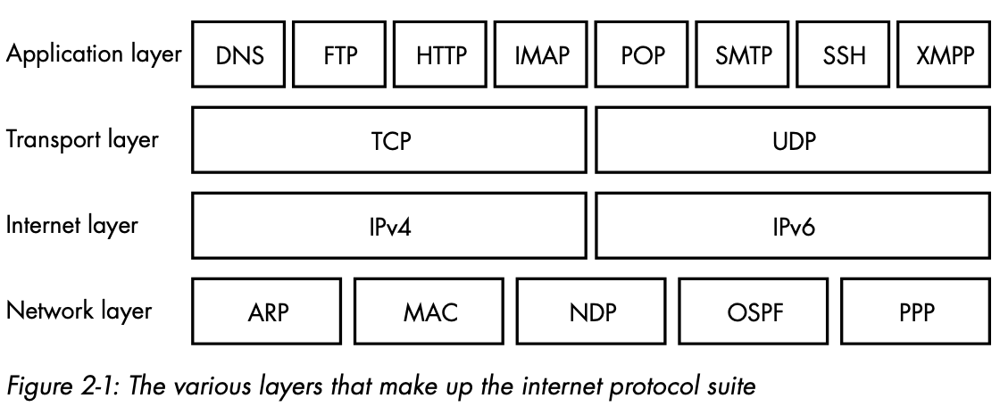

TCP remains the most common protocol because of its delivery guarantees, but nowadays, several other protocols are also used over the internet. The User Datagram Protocol (UDP), for instance, is a newer protocol that deliberately allows packets to be dropped so that data can be streamed at a constant rate. UDP is commonly used for streaming live video, since consumers prefer a few dropped frames over having their feed delayed when the network gets congested.

When browsers encounter a domain name for the first time, they use a local domain name server (typically hosted by an ISP) to look it up, and then cache the result to prevent time-consuming lookups in the future. This caching behavior means that new domains or changes to existing domains take a while to propagate on the internet. Exactly how long this propagation takes is controlled by the time-to-live (TTL) variable, which is set on the DNS record and instructs DNS caches when to expire the record. DNS caching enables a type of attack called DNS poisoning, whereby a local DNS cache is deliberately corrupted so that data is routed to a server controlled by an attacker.

In addition to returning IP addresses for particular domains, domain name servers host records that can describe domain aliases via canonical name (CNAME) records that allow multiple domain names to point to the same IP address. DNS can also help route email by using mail exchange (MX) records.

Emails are sent using the Simple Mail Transport Protocol (SMTP), instant messaging software often uses the **Extensible Messaging and Presence Protocol** (XMPP), file servers make downloads available via the File Transfer Protocol (FTP), and web servers use the HyperText Transfer Protocol (HTTP).

In Chapter 8, you’ll see why it’s important to use POST rather than GET requests when sending data to your server. Websites that erroneously use GET requests for doing anything other than retrieving resources are vulnerable to cross-site request forgery attacks.

The Lesser-Known HTTP Methods:

- HEAD: A HEAD request retrieves the same information as a GET request, but instructs the server to return the response without a body.
- CONNECT: CONNECT initiates two-way communications. You’ll use it in your HTTP client code if you ever have to connect through a proxy.
- OPTIONS: Sending an OPTIONS request lets a user agent ask what other methods are supported by a resource. Your web server will generally respond to OPTIONS requests by inferring which other methods you have implemented.
- TRACE: A response to a TRACE request will contain an exact copy of the original HTTP request, so the client can see what (if any) alterations were made by intermediate servers. This sounds useful, but it’s generally recommended that you turn off TRACE requests in your web server, because they can act as a security hole. For instance, they can allow malicious JavaScript injected into a page to access cookies that have been deliberately made inaccessible to JavaScript.

### Stateful Connections

Web servers typically deal with many user agents at once, but HTTP does nothing to distinguish which requests are coming from which user agent. This wasn’t an important consideration in the early days of the internet, because web pages were largely read-only. Modern websites, however, often allow users to log in and will track their activity as they visit and interact with different pages. To allow for this, HTTP conversations need to be made stateful. A connection or conversation between a client and a server is stateful when they perform a “handshake” and continue to send packets back and forth until one of the communicating parties decides to terminate the connection.

When a web server wants to keep track of which user it’s responding to with each request, and thus achieve a stateful HTTP conversation, it needs to establish a mechanism to track the user agent as it makes the subsequent requests. The entire conversation between a particular user agent and a web server is called an HTTP session. The most common way of tracking sessions is for the server to send back a Set-Cookie header in the initial HTTP response. This asks the user agent receiving the response to store a cookie, a small snippet of text data pertaining to that particular web domain. The user agent then returns the same data in the Cookie header of any subsequent HTTP request to the web server. If implemented correctly, the contents of the cookie being passed back and forth uniquely identify the user agent and hence establish the HTTP session.

### Encryption

To secure communications, web servers and browsers send requests and responses by using Transport Layer Security (TLS), a method of encryption that provides both privacy and data integrity. TLS ensures that packets intercepted by a third party can’t be decrypted without the appropriate encryption keys. It also ensures that any attempt to tamper with the packets will be detectable, which ensures data integrity.

HTTP conversations conducted using TLS are called HTTP Secure (HTTPS). HTTPS requires the client and server to perform a TLS handshake in which both parties agree on an encryption method (a cipher) and exchange encryption keys. Once the handshake is complete, any further messages (both requests and responses) will be opaque to outsiders.

