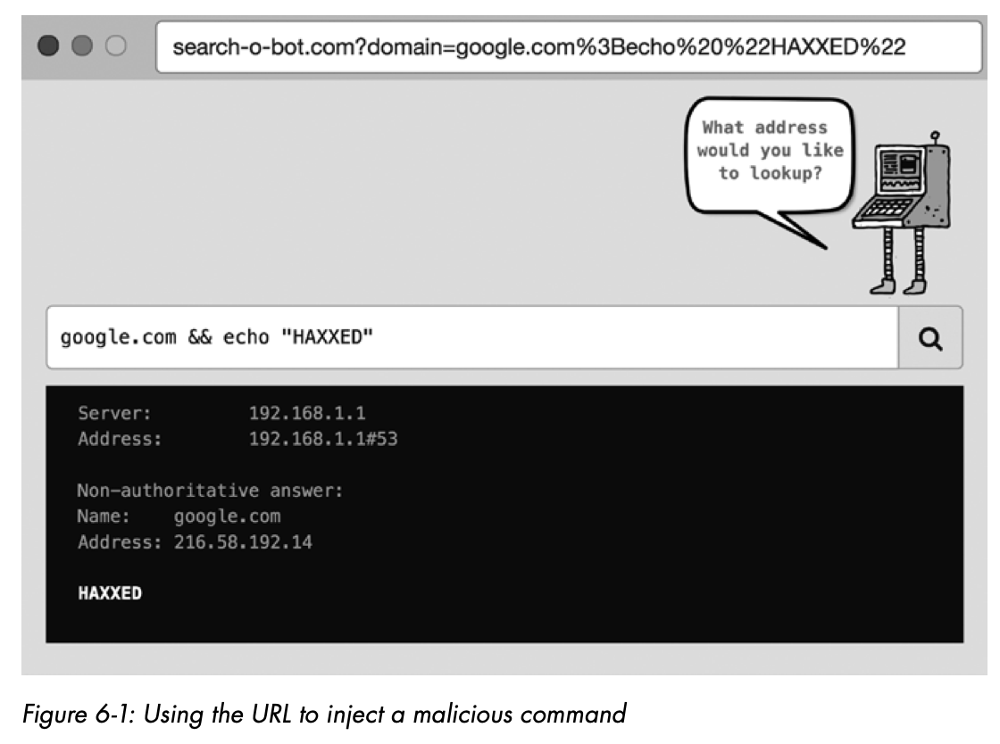
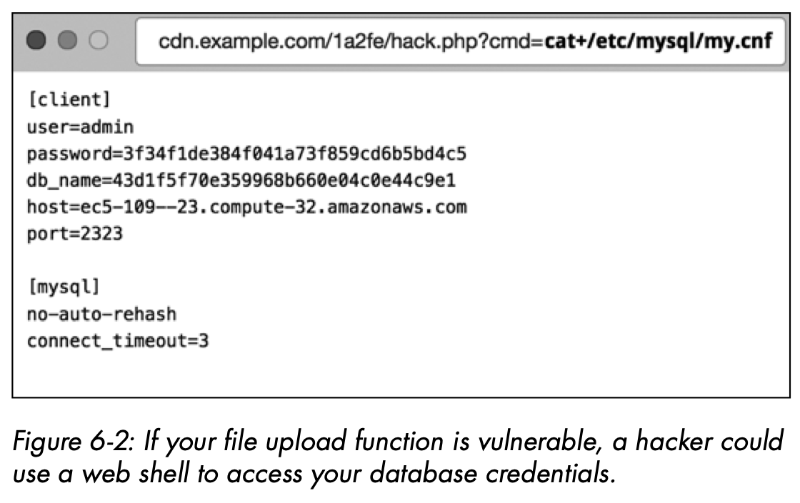

Server-side code has no reliable way of telling whether a script or a browser generated an HTTP request, because the contents of the HTTP request are indistinguishable regardless of the client. The best a server can do is to check the User-Agent header, which is supposed to describe the type of agent that generated the request, but scripts and hacking tools typically spoof the contents of this header, so it matches what a browser would send.

Knowing all of this, hackers attacking a website frequently pass malicious code in an HTTP request so that it tricks the server into executing the code. This is the basis of an injection attack on a website.

### SQL Injection

SQL injection attacks occur when the web server insecurely constructs the SQL statement it passes to the database driver. This allows the attacker to pass arguments via the HTTP request that cause the driver to perform actions other than those the developer intends.

```java
// Listing 6-2: An insecure method of reading user data from the database during a login attempt

Connection connection = DriverManager.getConnection(DB_URL, DB_USER, DB_PASSWORD); 
Statement statement = connection.createStatement(); 
String sql = "SELECT * FROM users WHERE email='" + email + "' AND encrypted_password='" + password + "'"; 
statement.executeQuery(sql);
```

The construction of this SQL statement isn’t secure! This snippet uses the email and password parameters taken from the HTTP request, and inserts them directly into the SQL statement. Because the parameters aren’t checked for SQL control characters (such as ') that change the meaning of the SQL statement, a hacker can craft input that bypasses the website’s authentication system. 

An example of this is shown in Listing 6-3. In this example, the attacker passes the user email parameter as `billy@gmail.com'--`, which terminates the SQL statement early and causes the password-checking logic to not execute:

```java
// Listing 6-3: Using SQL injection to bypass authentication

statement.executeQuery("SELECT * FROM users WHERE email='billy@gmail.com'--' AND encrypted_password='Z$DSA92H0'");
```

Listing 6-4 shows a SQL injection attack that runs a DROP command to remove the users table entirely, in order to corrupt the database.

```java
// Listing 6-4: A SQL injection attack in progress

statement.executeQuery("SELECT * FROM users WHERE email='billy@gmail.com'; DROP TABLE users;--' AND encrypted_password='Z$DSA92H0'");
```

In this scenario, the attacker passes the email parameter as `billy@gmail.com'; DROP TABLE users;--`. The semicolon character (`;`) terminates the first SQL statement, after which the attacker inserts an additional, destructive statement. The database driver will run both statements, leaving your database in a corrupt state!

To scan websites for SQL injection vulnerabilities, hacking tools like **Metasploit** can be used to crawl websites and test HTTP parameters with potential exploits. If your site is vulnerable to SQL injection attacks, you can be sure that somebody will eventually take advantage of it.

##### Mitigation 1: Use Parameterized Statements

To protect against SQL injection attacks, your code needs to construct SQL strings using **bind parameters**. Bind parameters are placeholder characters that the database driver will safely replace with some supplied inputs. A SQL statement containing bind parameters is called a parameterized statement.

SQL injection attacks use “control characters” that have special meaning in SQL statements to “jump out” of the context and change the whole semantics of the SQL statement. When you use bind parameters, these control characters are prefixed with “escape characters” that tell the database not to treat the following character as a control character. This escaping of control characters defuses potential injection attacks.

A securely constructed SQL statement using bind parameters should look like Listing 6-5.

```java
// Listing 6-5: Using bind parameters to protect against SQL injection

Connection connection = DriverManager.getConnection(DB_URL, DB_USER, DB_PASSWORD); 
Statement statement = connection.createStatement();
String sql = "SELECT * FROM users WHERE email = ? and encrypted_password = ?"; 
statement.executeQuery(sql, email, password);
```

```java
// Listing 6-6: The SQL injection attack is defused.

statement.executeQuery(
  "SELECT * FROM users WHERE email = ? AND encrypted_password = ?",   
  "billy@email.com'--",   
  "Z$DSA92H0");
```

Parameterized statements ensure that the database driver treats all control characters (such as `'`, `--`, and `;`) as an input to the SQL statement, rather than as part of the SQL statement.

##### Mitigation 2: Use Object-Relational Mapping

Because ORMs use bind parameters under the hood, they protect against injection attacks in most cases. However, most ORMs also have backdoors that allow the developer to write raw SQL if needed. If you use these types of functions, you need to be careful about how you construct the SQL statements. For instance, Listing 6-8 shows Rails code that is vulnerable to injection.

```ruby
# Listing 6-8: Ruby on Rails code that is vulnerable to injection

def find_user(email, password)   
  User.where("email = '" + email + "' and encrypted_password = '" + password + "'") 
end
```

Because this code passes part of the SQL statements as a raw string, an attacker can pass in special characters to manipulate the SQL statement that Rails generates. If the attacker can set the password variable to `' OR 1=1`, they can run a SQL statement that disables the password check, as shown in Listing 6-9.

```sql
-- Listing 6-9: The 1=1 statement, which is trivially true, disables the password check.

SELECT * FROM users WHERE email='billy@gmail.com' AND encrypted_password ='' OR 1=1
```

You can securely call the where function in Rails by using bind parameters, as shown in Listing 6-10.

```ruby
# Listing 6-10: Secure use of the where function

def find_user(email, encrypted_password)   
  User.where(["email = ? and encrypted_password = ?", email, encrypted_password]) 
end
```

##### Bonus Mitigation: Use Defense in Depth

As a rule of thumb, you should always secure your website with redundancies. It’s not enough to check your code line by line for vulnerabilities. You need to consider and enforce security at every level of the stack, allowing failures at one level to be mitigated by other strategies. This is an approach called **defense in depth**.

An additional way to mitigate injection attacks is to follow the **principle of least privilege**, which demands that every process and application run only with the permissions it needs to perform its permitted functions, and no more. This means that if an attacker injects code into your web server and compromises a particular software component, the damage they can do is limited to the actions permissible by that particular software component. 

If your web server talks to a database, make sure the account it uses to log into the database has limited permissions on the data. Most websites need to run only SQL statements that fall under the subset of SQL called the **data manipulation language** (**DML**), which includes the `SELECT`, `INSERT`, `UPDATE`, and `DELETE` statements we discussed earlier.

A subset of the SQL language called **data definition language** (**DDL**) uses `CREATE`, `DROP`, and `MODIFY` statements to create, drop, and modify the table structures in the database itself. Web servers generally don’t require permissions to execute **DDL** statements, so don’t grant them the **DDL** set of permissions at runtime! Narrowing the web server privileges to the minimal **DML** set reduces the harm an attacker can do if they discover a code vulnerability.

### Command Injection

If your web application makes command line calls, make sure to construct your command strings securely. Otherwise, attackers can craft HTTP requests that execute arbitrary operating system commands, and seize control of your application.

The PHP code takes the domain or IP address from the HTTP request and constructs an operating system call as shown in Listing 6-11.

```php
// Listing 6-1 1: PHP code receiving an HTTP request and constructing an operating system call

<?php     
  if (isset($_GET['domain'])) {         
    echo '<pre>';         
    $domain = $_GET['domain'];         
    $lookup = system("nslookup {$domain}");         
    echo($lookup);         
    echo '</pre>';     
  } 
?>
```



##### Mitigation: Escape Control Characters

As with SQL injection, you can defend against command injection by properly escaping inputs from the HTTP request. This means replacing sensitive control characters (like the `&` character in our example) with a safe alternative. How you do this depends on the operating system and programing language you’re using. To make the PHP code in Listing 6-11 more secure, we simply need to use a call to `escapeshellarg`, as shown in Listing 6-12.

```php
// Listing 6-12: PHP code escaping inputs from the HTTP request

<?php     
  if (isset($_GET['domain'])) {         
    echo '<pre>';         
    $domain = escapeshellarg($_GET['domain']);         
    $lookup = system("nslookup {$domain}");         
    echo($lookup);         
    echo '</pre>';     
  } 
?>
```

In Python, the `call()` function should be invoked with an array, rather than a string, to prevent attackers from tagging extra commands onto the end.

```python
# Listing 6-13: The call function in Python’s subprocess module

from subprocess import call     
call(["nslookup", domain])
```

In Ruby, the system() function makes a command line call. Supply it with an array of arguments, rather than a string, to ensure that attackers can’t sneak in extra commands.

```ruby
# Listing 6-14: The system() function in Ruby

system("nslookup", domain)
```

### Remote Code Execution

An attacker can achieve remote code execution by discovering a vulnerability in a particular type of web server, and then creating exploit scripts to target websites running on that web server technology. The exploit script incorporates malicious code in the body of the HTTP request, encoded in such a way that the server will read and execute that code when the request is handled.

##### Mitigation: Disable Code Execution During Deserialization

Remote code execution vulnerabilities usually occur when web server software uses insecure **serialization**. Serialization is the process of converting an in-memory data structure into a stream of binary data, usually for the purpose of passing the data structure across a network. **Deserialization** refers to the reverse process that occurs at the other end, when the binary data is converted back into a data structure.

If a web server uses deserialization to handle data coming in from HTTP requests, it needs to defuse any serialization libraries it uses by disabling any code-execution capabilities; otherwise, an attacker may be able to find a way to inject code directly into the web server process. We can typically disable code execution via a relevant configuration setting that will allow your web server software to deserialize data without executing code.

As a developer who uses a web server to build sites, rather than one who writes the web server code itself, protecting against remote code execution in your web stack usually amounts to staying aware of security advisories. You’re unlikely to be writing your own serialization libraries, so be aware of where your codebase uses third-party serialization libraries. Make sure to turn off active code execution features in your own code, and keep an eye out for vulnerability announcements issued by your web server vendor.

### File Upload Vulnerabilities

Browsers aren’t exactly careful about checking the contents of a file. Attackers can easily abuse file upload functions by injecting malicious code into an uploaded file. Web servers typically treat uploaded files like large blobs of binary data, so it’s pretty easy for an attacker to upload a malicious payload without the web server detecting it. Even if your site has JavaScript code that checks a file’s content before uploading it, an attacker can write scripts to post file data to the server-side endpoint directly, circumventing any security measures you put in place on the client side.

As an example of a file upload vulnerability, let’s look at how an attacker could potentially abuse the profile image upload function of your site. The attacker first writes a small web shell, a simple executable script that will take an argument from an HTTP request, execute it on the command line, and output the result. Web shells are a common tool used by hackers attempting to compromise a web server. Listing 6-15 shows an example of a web shell written in PHP.

```php
// Listing 6-15: A web shell written in the PHP language

<?php   
  if(isset($_REQUEST['cmd'])) {     
    $cmd = ($_REQUEST['cmd']);     
    system($cmd);   
  } else {     
    echo "What is your bidding?";   
  } 
?>
```

The attacker saves this script as `hack.php` on their computer and uploads it as their profile “image” on your site. PHP files are typically treated by operating systems as executable files, which is key to making this attack work. Clearly a file ending with `.php` isn’t a valid image file, but the attacker can fairly easily disable any JavaScript file-type checking done during the upload process.

Once the attacker has uploaded their “image” file, their website profile page will show a missing image icon, because their profile image is corrupted and not actually an image. However, at this point they have achieved their real aim: smuggling the web shell file onto your server, which means their malicious code is now deployed to your site, waiting to be executed in some fashion.

Because the web shell is available on a public URL, the attacker has potentially created a backdoor for executing the malicious code. If your server’s operating system has a PHP runtime installed, and the file was written to disk with executable privileges during the upload process, the attacker can pass commands to run the web shell simply by invoking the URL that corresponds to their profile image.

To perform a command injection attack, the hacker can pass a cmd argument to the web shell to execute arbitrary operating system commands on your server, as shown in Figure 6-2.



You can use several mitigations to protect yourself against vulnerabilities in file upload code. The most important mitigations ensure that any uploaded files can’t be executed as code. Following the principle of defense in depth, you should also analyze uploaded files and reject any that appear to be corrupt or malicious.

##### Mitigation 1: Host Files on a Secure System

The first, most important approach to securing file upload functions is to ensure that your web server treats uploaded files as inert rather than executable objects. You can do this by hosting your uploaded files in a **content delivery network** (**CDN**) such as **Cloudflare** or **Akamai**, which offloads the security burden to a third party who stores your files securely.

If for some reason a **CDN** isn’t an option, you can get many of the same benefits by storing uploaded files in cloud-based storage (for example, **Amazon Simple Storage Service**, or **S3**) or a dedicated content management system. Both approaches provide secure storage that defuses all web shells as they’re uploaded. (Although, if you’re hosting your own content management system, you’ll have to make sure to configure it correctly.)

##### Mitigation 2: Ensure Uploaded Files Cannot Be Executed

If using a CDN or content management system isn’t an option, you need to take the same steps to secure your files that a CDN or content management does behind the scenes. This means ensuring that all files are written to disk without executable permissions, separating uploaded files into a particular directory or partition (so they aren’t intermingled with code), and hardening your servers so that only the minimally required software is installed. (Uninstall the PHP engine if you aren’t using it!) It’s a good idea to rename files as you upload them too, so you don’t write files with dangerous file extensions to disk.

The ways to achieve these ends vary depending on your hosting technology, operating system, and the programming language you use. If you’re running a Python web server on Linux, for instance, you can set file permissions when creating a file by using the os module, as shown in Listing 6-16.

```python
# Listing 6-16: Writing a file with read-write (but not execute) permissions in Python on Linux

import os 
file_descriptor = os.open("/path/to/file", os.O_WRONLY | os.O_CREAT, 0o600) 
with os.fdopen(open(file_descriptor, "wb")) as file_handle:   
  file_handle.write(...)
```

Removing unneeded software from your operating system is always a good idea, because it gives a hacker fewer tools to play with.

##### Mitigation 3: Validate the Content of Uploaded Files

If you’re uploading files with a known file type, consider adding some filetype checking in your code. Make sure the `Content-Type` header in the HTTP request of the upload matches the expected file type, but be aware that an attacker can easily spoof the header.

It’s possible to validate the file type after the file has been uploaded, particularly with image files, so it’s a good idea to implement this feature in your server-side code, as shown in Listing 6-17. 

```python
# Listing 6-17: Reading the file headers to validate a file format in Python

>>> import imghdr 
>>> imghdr.what('/tmp/what_is_this.dat') 
'gif'
```

##### Mitigation 4: Run Antivirus Software


