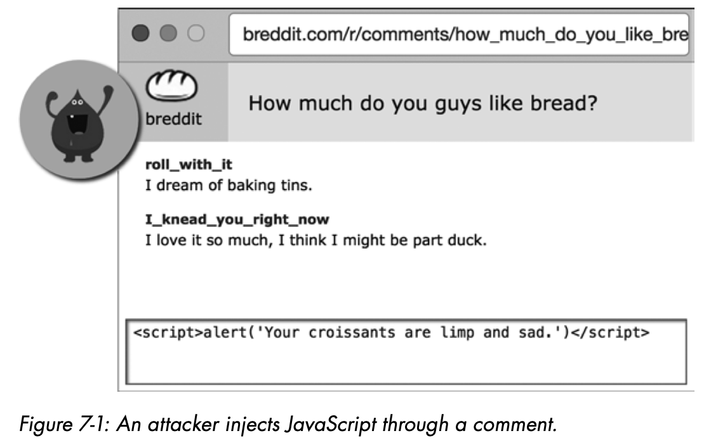
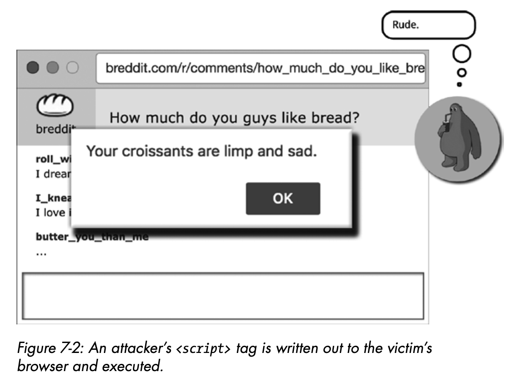
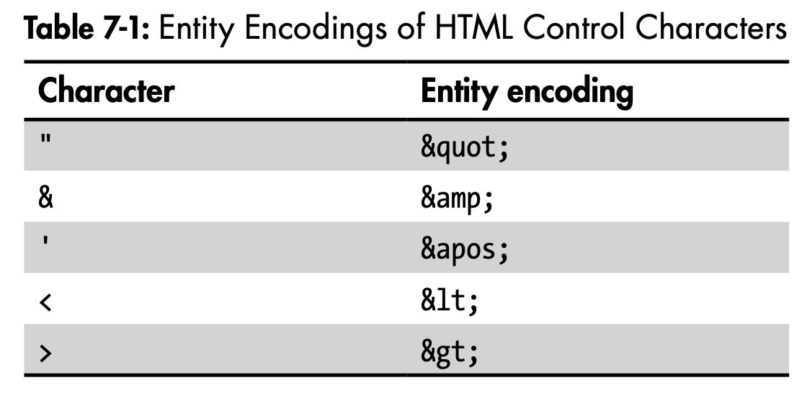
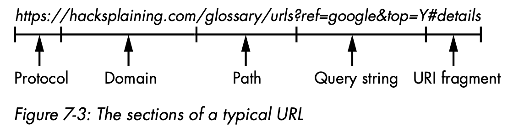

Browsers obediently execute any JavaScript code that appears in a web page, so if an attacker can find a way to inject malicious JavaScript into a user’s browser while the user views your website, that user is in for a bad time. We call this type of code injection a **cross-site scripting** (**XSS**) attack.

### Stored Cross-Site Scripting Attacks

Any page content coming from the database is a potential attack vector for hackers. Attackers will attempt to inject JavaScript code into the database so that the web server will write out the JavaScript when it renders HTML. We call this type of attack a stored cross-site scripting attack: the JavaScript is written to the database, but executed in the browser when an unsuspecting victim views a particular page on the site.

Malicious JavaScript can be planted in a database by using the SQL injection method, but attackers will more commonly insert malicious code through legitimate avenues. For instance, if a website allows users to post comments, the site will store the comment text in a database and display it back to other users who view the same comment thread. In this scenario, an easy way for a hacker to perform a cross-site scripting attack is to write a comment containing a `<script>` tag to the database. If the website fails to construct HTML securely, the `<script>` tag will get written out whenever the page is rendered to other users, and the JavaScript will be executed in the victim’s browser.





##### Mitigation 1: Escape HTML Characters

To prevent stored cross-site scripting attacks, you need to escape all dynamic content coming from a datastore so that the browser knows to treat it as the content of HTML tags, as opposed to raw HTML. Escaping content in the browser means replacing control characters in the HTML with their corresponding entity encoding, as illustrated in Table 7-1.



Any character that has special meaning in HTML, like the `<` and `>` characters that denote the start and end of tags, has a corresponding safe entity encoding. Browsers that encounter entity encodings recognize them as escaped characters, and render them visually as the appropriate character, but, crucially, won’t treat them as HTML tags. Listing 7-1 shows how a secure website will write out the comment entered by the attack in Figure 7-1. The bolded text represents characters that could be used to construct HTML tags.

```html
<!-- Listing 7-1: This attempted XSS attack has been defused. -->

<div class="comment">&lt;script&gt;alert(&quot;HAXXED&quot;)&lt;/script&gt;</div>
```

The conversion of escaped characters to unescaped characters happens after the browser has constructed the DOM for the page, so the browser will not execute the `<script>` tag. Escaping HTML control characters in this fashion closes the door on most cross-site scripting attacks.

Since cross-site scripting is such a common vulnerability, modern web frameworks tend to escape dynamic content by default. Templates, in particular, typically escape interpolated values without being asked. The syntax for interpolating a variable in an **Embedded Ruby** (**ERB**) template looks like Listing 7-2.

```erb
<!-- Listing 7-2: Implicit escaping of dynamic content in an Embedded Ruby template -->

<div class="comment">
  <%= comment %>
</div>
```

In order to write raw, unescaped HTML (and hence be vulnerable to XSS attacks), ERB templates require an explicit call to the raw function, as shown in Listing 7-3.

```erb
<!-- Listing 7-3: The syntax to allow raw injection of HTML in Embedded Ruby templates -->

<div class="comment">
  <%= raw comment %>
</div>
```

All secure templating languages follow the same design principle: the templating engine implicitly escapes dynamic content unless the developer explicitly chooses to construct raw HTML.

##### Mitigation 2: Implement a Content Security Policy

Modern browsers allow websites to set a **content security policy**, which you can use to lock down JavaScript execution on your site. Cross-site scripting attacks rely on an attacker being able to run malicious scripts on a victim’s web page, usually by injecting `<script>` tags somewhere within the `<html>` tag of a page, also known as inline JavaScript. The example hack illustrated in Figure 7-2 uses inline JavaScript, written out as the text of a comment.

By setting a **content security policy** in your HTTP response headers, you can tell the browser to never execute inline JavaScript. The browser will execute JavaScript on your page only if it is imported via a `src` attribute in the `<script>` tag. A typical content security policy header will look like Listing 7-4. This policy specifies that scripts can be imported from the same domain ('`self`'), or the `apis.google.com` domain, but inline JavaScript should not be executed.

```htaccess
# Listing 7-4: A content security policy set in an HTTP response header

Content-Security-Policy: script-src 'self' https://apis.google.com
```

You can also set your site’s content security policy in a `<meta>` tag in the `<head>` element of the HTML of your web pages, as shown in Listing 7-5.

```html
<meta http-equiv="Content-Security-Policy" content="script-src 'self' https://apis.google.com" />
```

To permit inline JavaScript, the policy would have to include the keyword `unsafe-inline`.

Preventing the execution of inline JavaScript is a great security measure, but it means you’ll have to move any inline JavaScript your site currently implements into separate imports. In other words, `<script>` tags on a page have to reference JavaScript in a separate file via a `src` attribute, rather than writing the JavaScript between the start and end tags.

This separation of JavaScript into external files is the preferred approach in web development, since it makes for a more organized codebase. Inline script tags are considered bad practice in modern web development, so banning inline JavaScript actually forces your development team into good habits. Nevertheless, inline script tags are common in older, legacy sites. Indeed, it may take some time to refactor your templates to remove all inline JavaScript tags.

To help with this refactoring, consider using content security policy violation reports. If you add a `report-uri` directive to your **content security policy** header, as shown in Listing 7-6, the browser will notify you of any policy violations, rather than preventing JavaScript from executing.

```htaccess
# Listing 7-6: A content security policy that instructs the browser to report any content security violations to https:/ /example.com/csr-reports

Content-Security-Policy-Report-Only: script-src 'self'; report-uri https://example.com/csr-reports
```

If you collect all these violation reports in a log file, your development team should be able to see all the pages they need to rewrite in order to meet the restrictions imposed by the proposed content security policy.

You should set a **content security policy** in addition to escaping HTML, since it’ll protect your users effectively! It’s difficult for an attacker to find an instance of unescaped content and to smuggle a malicious script onto your whitelisted domains.

### Reflected Cross-Site Scripting Attacks

Rogue JavaScript in the database isn’t the only vector for **cross-site scripting** attacks. If your site takes part of an HTTP request and displays it back in a rendered web page, your rendering code needs to protect against attacks that inject malicious JavaScript via the HTTP request. We call this type of attack a **reflected cross-site scripting attack**.

Virtually all websites display some part of HTTP requests in rendered HTML. Consider the Google search page: if you perform a search for “cats”, Google passes the search term as part of the HTTP in the URL: `https://www.google.com/search?q=cats`. The search term cats displays in the search box above the search results.

Now, if Google were a less secure company, it’d be possible to replace the cats parameter in the URL with malicious JavaScript, and have that JavaScript code execute whenever anybody opens that URL in their browser. An attacker could email the URL as a link to a victim, or trick a user into visiting the URL by adding it to a comment. This is the essence of a **reflected cross-site scripting attack**: an attacker sends the malicious code in the HTML request, and then the server reflects it back.

##### Mitigation: Escape Dynamic Content from HTTP Requests

You mitigate reflected cross-site scripting vulnerabilities the same way you mitigate stored cross-site scripting vulnerabilities: by escaping control characters in dynamic content that the website interpolates into HTML pages. Whether dynamic content comes from the backend database or the HTTP request, you need to escape it in the same way.

Thankfully, template languages typically apply escaping to all interpolated variables, whether the templates load them from the database or pull them from the HTTP request. However, your development team still needs to be aware of the risk of injection via HTTP requests when auditing code. Code reviews often overlook reflected cross-site scripting vulnerabilities because developers are too busy looking for stored cross-site scripting vulnerabilities.

Common target areas for reflected cross-site scripting attacks are _search pages_ and _error pages_, since they usually display parts of the query string back to the user. Make sure your team understands the risks and knows how to spot the vulnerability when reviewing code changes. Stored cross-site scripting attacks tend to be more harmful, because a single malicious piece of JavaScript injected into your database table can attack your users over and over again. But reflected attacks are more common, since they’re easier to implement.

### DOM-Based Cross-Site Scripting Attacks

Defusing most cross-site scripting attacks means inspecting and securing server-side code; however, the increasing popularity of rich frameworks for client-side code has led to the rise of DOM-based cross-site scripting, whereby attackers smuggle malicious JavaScript into a user’s web page via the URI fragment.

To understand these attacks, you first need to understand how URI fragments operate. Let’s start with a reminder of how URLs (universal resource locators), the addresses shown in the browser bar, are structured. A typical URL looks like Figure 7-3.



The URI fragment is the optional part of the URL after the `#` sign. Browsers use URI fragments for intra-page navigation—if an HTML tag on the page has an id attribute matching the URI fragment, the browser scrolls to that tag after opening the page. For instance, if you load the URL https://en.wikipedia.org/wiki/Cat#Grooming in a browser, the browser opens the web page and then scrolls to the Grooming section of the Wikipedia page about cats.

Single-page apps also often use URI fragments to record and reload state in an intuitive fashion. These types of apps, written in JavaScript frameworks like Angular, Vue.js, and React, are actually JavaScript-heavy web pages that seek to avoid the rendering blink that occurs when the browser reloads a web page.

One potential way to avoid this rendering blink is designing the whole app to load under a static URL that never changes, because changing the URL in the browser bar is typically what causes a web page to reload. However, if a user refreshes a browser for an unchanging URL, the browser resets the web page to its initial state, losing any information about what the user was doing previously.

Many single-page apps overcome this by using the URI fragment to keep state over browser refreshes. You’ll commonly see web pages implement infinite scrolling: a list of images dynamically loads in as the user scrolls down the page. The URI fragment updates with an indication of how far the user has scrolled down. Then, even if the browser refreshes, the JavaScript code can interpret the content of the URI fragment, and load in the relevant number of images as the page refreshes.

By design, browsers don’t send URI fragments to the server when the browser renders the page. When a browser receives a URL with a URI fragment, it makes a note of the fragment, strips it from the URL, and sends the stripped URL to the web server. Any JavaScript executed on the page can read the URI fragment, and the browser will write the full URL to the browser history, or to a bookmark, if the user bookmarks the page.

Unfortunately, this means that URI fragments aren’t available to any server-side code—securing server-side code can’t mitigate DOM-based XSS attacks. Client-side JavaScript code that interprets and uses URI fragments needs to be careful about how it interprets the content of those fragments. If the content is unescaped and written directly into the DOM of the web page, an attacker can smuggle malicious JavaScript through this channel. An attacker can craft a URL with some malicious JavaScript in the URI fragment, and then trick a user into visiting that URL to launch the cross-site scripting attack.

DOM-based cross-site scripting is a relatively new form of attack, but is particularly dangerous because the injection of code happens completely on the client side, and can’t be detected by examining web server logs! This means you need to be keenly aware of the vulnerability when doing code reviews, and know how to mitigate it.

##### Mitigation: Escaping Dynamic Content from URI Fragments

Any JavaScript code executing in the browser that takes part of the URI fragment and constructs HTML is prone to DOM-based cross-site scripting attacks. This means you need to take care to escape anything taken from a URI fragment before interpolating that value in HTML with the client-side code, just as you would with server-side code.

The authors of modern JavaScript templating frameworks are fully aware of the risks posed by URI fragments and discourage the construction of raw HTML in code. For instance, the syntax to write unescaped HTML in the React framework requires the developer to call the function `dangerouslySetInnerHTML`, as shown in Listing 7-8.

```react
// Listing 7-8: Dangerously setting raw HTML from text in the React framework

function writeSomeHTML() {
  return { __html: "First &middot; Second" };
}

function MyComponent() {
  return <div dangerouslySetInnerHTML={writeSomeHTML()} />;
}
```

