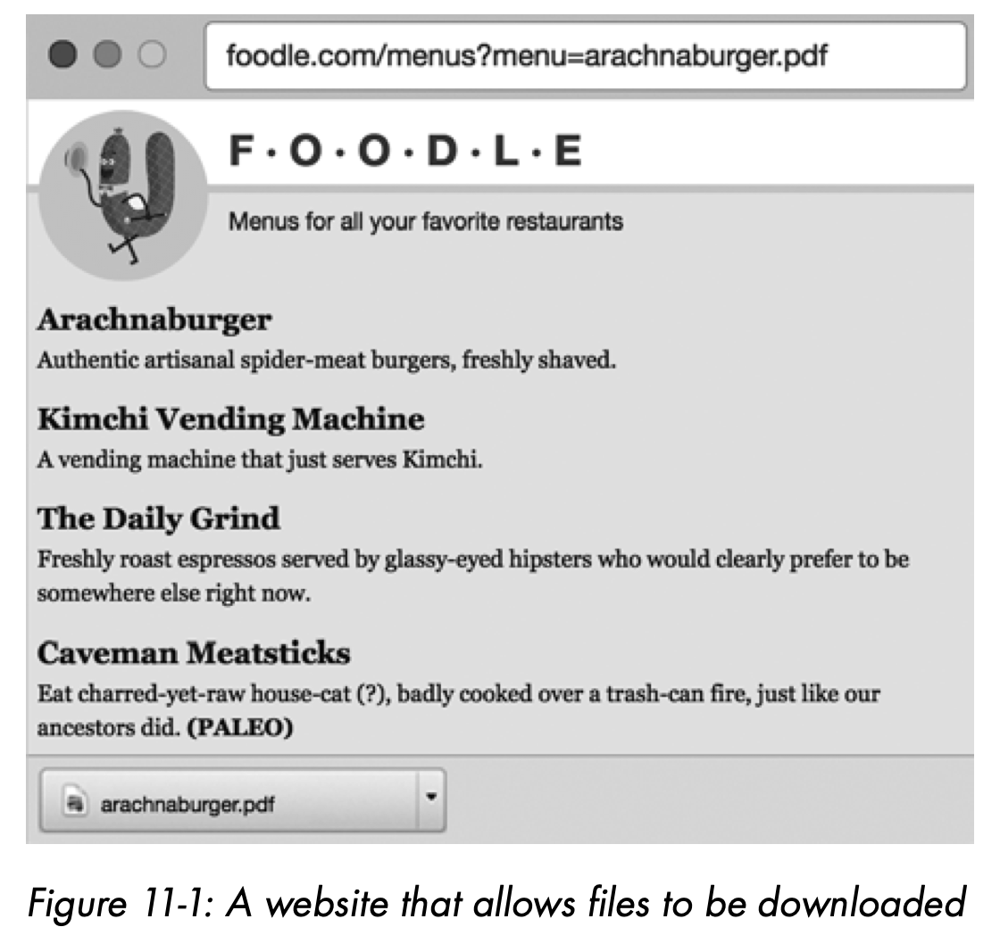
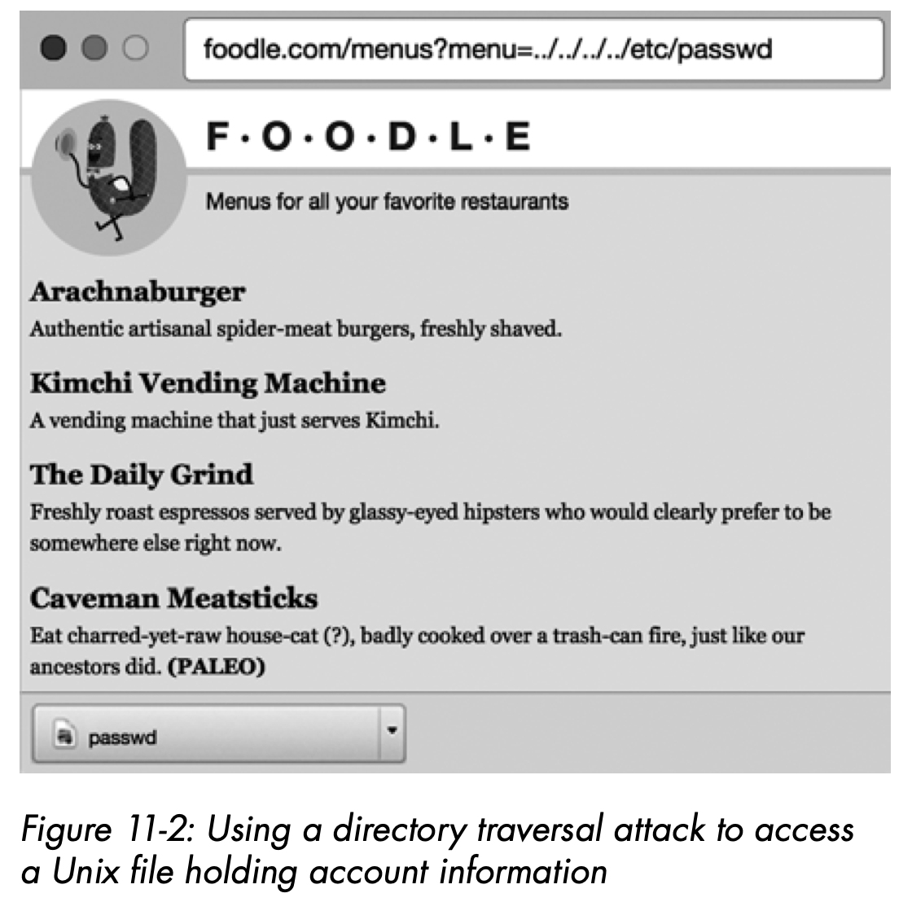
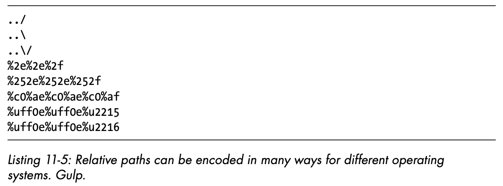

### Privilege Escalation

Security experts divide privilege escalation attacks into two categories: vertical and horizontal escalation. 

In vertical escalation, an attacker gets access to an account with broader permissions than their own. If an attacker can deploy a web shell on your server—an executable script that takes elements of the HTTP request and runs them on the command line—one of their first aims will be to escalate their way to root privilege, so they can perform any actions they wish on the server. Ordinarily, commands sent to the web shell will be executed under the same operating system account that the web server is running, which generally has limited network and disk access. Hackers have found a lot of ways to perform vertical escalation attacks on operating systems in an attempt to get root access—which allows them to infect the whole server from a web shell.

In horizontal escalation, an attacker accesses another account with similar privileges as their own. In the last couple of chapters, we’ve discussed common ways of performing this type of attack: guessing passwords, hijacking sessions, or maliciously crafting HTTP request data. The September 2018 Facebook hack was an example of horizontal escalation, caused by an API that issued access tokens without correctly verifying the user’s permissions.

To secure your site from escalation attacks, you need to securely implement access control for all sensitive resources.

### Access Control

Your access control strategy should cover three key aspects: 

- **Authentication**: Correctly identifying a user when they return to the site 

- **Authorization**: Deciding which actions a user should and shouldn’t be able to perform after they’ve identified themselves 

- **Permission checking**: Evaluating authorization at the point in time when a user attempts to perform an action

##### Designing an Authorization Model

###### Access Control Lists

Access control lists (ACLs) are a simple way of modeling authorization that attach against each object in your system a list of permissions, specifying the actions that each user or account can perform on that object. The canonical example of an ACL-based model is the Linux filesystem, which can individually grant each user read, write, or execute permissions on each file and directory. Most SQL databases also implement ACL-based authorization—the account you use to connect to the database determines which tables you can read or update, or whether you can change table structures.

###### Whitelists and Blacklists

A whitelist describes the users or accounts that can access a particular resource, and bans all other users. A blacklist explicitly describes the users or accounts that are banned from accessing a resource, implying that the resource should be made accessible to any other user or account.

###### Role-Based Access Control

Probably the most comprehensive authorization model is *role-based* access control (RBAC), which grants users *roles*, or adds users to *groups* that it has granted specific roles. *Policies* in the system define how each role can interact with specific *subjects*—resources within the computing system.

###### Ownership-Based Access Control

In the age of social media, it has become common to organize access control rules around the idea of *ownership*, whereby each user has full control over the photos they upload or the posts they create.

##### Implementing Access Control

##### Testing Access Control

##### Adding Audit Trails

Audit trails are log files or database entries that are recorded whenever a user performs an action. Simply adding logging statements as users navigate your site `(14:32:06 2019-02-05: User example @gmail.com logged in)` can help you diagnose any problems as they occur at runtime, and provide vital evidence in the event that you do get hacked.

##### Avoiding Common Oversights

A common oversight you see on many websites is that that they omit access control for resources that aren’t designed to be discoverable. It’s easy to assume that pages on your site that aren’t linked to from elsewhere will be hidden from hackers, because those pages won’t be highlighted as hackers crawl your site. This isn’t true.

Hacking tools can quickly enumerate private URLs that feature opaque IDs, like `http://example.com/item?id=423242`, and it’s even easier to access private URLs with a guessable structure like `http://example.com/profiles/user/bob`. Relying on an attacker being unable to guess a URL is called **security through obscurity** and is considered a risk.

Every sensitive resource on your site requires access control. If your site allows users to download files, hackers may try to access files that they should not be permitted to download, using a hacking method called **directory traversal**.

### Directory Traversal

If any of your website’s URLs contain parameters describing paths to files, attackers can use directory traversal to bypass your access control rules. In a **directory traversal** attack, an attacker manipulates the URL parameters in order to access sensitive files that you never intended to be accessible. Directory traversal attacks usually involve replacing a URL parameter with a relative filepath that uses the `../` syntax to “climb out” of the hosting directory.

If your server-side code allows an attacker to pass and evaluate relative filepaths in place of filenames, they can probe your filesystem for interesting-looking files, breaking access control. The relative path syntax lets the attacker read files outside the web server’s home directory, letting them probe for directories that commonly hold password or configuration information and read the data contained within them. Let’s look at an example of such an attack.

##### Mitigation 1: Trust Your Web Server

To protect yourself against directory traversal attacks, first familiarize yourself with how your web server resolves static content URLs.

##### Mitigation 2: Use a Hosting Service

If you serve files that aren’t part of your codebase, perhaps because users or site administrators upload them, you should strongly consider hosting them in a content delivery network, in cloud storage, or in a content management system. These software types not only mitigate file upload vulnerabilities, as discussed in Chapter 6, but also defuse directory traversal attacks by allowing you to refer to files either by secure URLs or opaque file identifiers.

##### Mitigation 3: Use Indirect File References

If you write your own code to serve files from a local disk, the most secure way of defusing directory traversal attacks is via indirection: you assign each file an opaque ID that corresponds to a filepath, and then have all URLs reference each file by that ID. This requires you to keep some sort of registry that pairs each file ID to a path, say, within a database.

##### Mitigation 4: Sanitize File References

Finally, if you do end up using direct file references in your URLs, you need to secure your site code to ensure that arbitrary paths can’t be passed in place of filenames. The most secure approach is simply banning any file reference that includes path separator characters, including *encoded* separator characters. (Note that Windows- and Unix-based operating systems use different path separators: \ and /, respectively.) If possible, try to use a third-party library to sanitize filenames.

